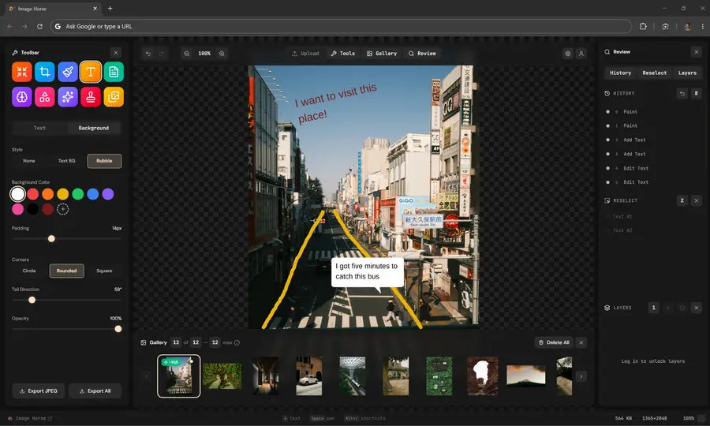

Image Horse



**Live:** [rust-wasm-photo-tool.netlify.app](https://rust-wasm-photo-tool.netlify.app/) &nbsp;·&nbsp; [Architecture](Architecture.md)

A browser-based image annotation and editing tool powered by **Rust/WASM** for pixel-level operations, **React + TypeScript** for the UI, and **Convex** for persistent storage. Edits run locally in WebAssembly — your pixels never leave the tab unless you sign in for persistence or AI features. Includes a **Batch Image Editor** for applying a logo to many photos in one pass, with a grid mosaic view of the gallery.

> Previously called **Clone Stamp App** — the app grew well beyond its origins as a single clone stamp tool.

## Architecture

```
┌─────────────────────────────────────────────────────────────────┐
│  Browser                                                        │
│                                                                 │
│  ┌──────────────────────────────────────────────────────────┐   │
│  │  React UI Shell (Framer Motion, Tailwind CSS)            │   │
│  │                                                          │   │
│  │  TopBar · ToolsSidebar · GalleryBar · ReviewPanel         │   │
│  │  UploadDialog · StatusBar · ShortcutModal                │   │
│  └────────────────────┬─────────────────────────────────────┘   │
│                       │ useCloneStamp / useImageHorse hook      │
│                       ▼                                         │
│  ┌──────────────────────────────────────────────────────────┐   │
│  │  stamp_tool.wasm  (ImageHorseTool, ~80KB gzipped)        │   │
│  │                                                          │   │
│  │  ┌──────────┐ ┌──────────┐ ┌───────────┐ ┌──────────┐   │   │
│  │  │  core    │ │  stamp   │ │ transform │ │ filters  │   │   │
│  │  │ ImageBuf │ │ Brush    │ │ Flip/Rot  │ │ Bright   │   │   │
│  │  │ Bilinear │ │ Dab/Strk │ │ Copy/Pste │ │ Contrast │   │   │
│  │  └──────────┘ └──────────┘ └───────────┘ └──────────┘   │   │
│  │  ┌──────────┐ ┌──────────┐ ┌───────────┐                │   │
│  │  │  codec   │ │ history  │ │ drawing   │ All share one  │   │
│  │  │ PNG enc  │ │ Undo/Redo│ │ Arrows    │ pixel buffer   │   │
│  │  │ Thumbnail│ │ Snapshot │ │ Shapes    │ in WASM linear │   │
│  │  └──────────┘ └──────────┘ └───────────┘ memory.        │   │
│  └──────────────────────────────────────────────────────────┘   │
│                       │                                         │
│                       ▼                                         │
│  ┌──────────────────────────────────────────────────────────┐   │
│  │  Convex (persistent layer)                               │   │
│  │                                                          │   │
│  │  userProfiles · projects · images · layers               │   │
│  │  annotations · history · ai_jobs · subscriptions         │   │
│  │                                                          │   │
│  │  Auth via @convex-dev/auth (Clerk)                       │   │
│  └──────────────────────────────────────────────────────────┘   │
│                                                                 │
│  Originals → IndexedDB (SHA-256 keyed, content-addressed)       │
│  Working copies downscaled to ≤2048px long edge on upload       │
│  JPEG/WebP/AVIF export → browser canvas.toBlob()                │
│  PNG export → Rust `png` crate (lossless, no canvas needed)     │
└─────────────────────────────────────────────────────────────────┘
```

### Layers & compositing

As of v3.5 the WASM core is no longer a single pixel buffer — `ImageHorseTool` holds a **stack of layers** (`Vec<Layer>`) plus an active-layer index. Each `Layer` owns its own RGBA buffer **and** its own live text + shape annotations, so every canvas tool (paint, clone stamp, blur, brightness/contrast, text, shapes, emoji, paste) edits the **active layer**. The on-screen canvas is the **composite** of all visible layers, blended bottom→top source-over and scaled by each layer's opacity (normal blending; v3.5 is opacity + visibility only).

A reusable `composite_cache` is rebuilt by `recomposite()` and exposed through `data_ptr()/data_len()` for the zero-copy blit; a fast path copies straight through when there's a single fully-opaque layer with no overlays (so simple single-layer edits stay allocation-free). `export_png`, `get_image_data`, and the thumbnail path all composite the full stack, so export always matches what's on screen. History snapshots capture the **entire stack** (layers + active index + dimensions), making add / delete / reorder / merge undoable alongside pixel edits.

### Why one WASM binary?

Separate `.wasm` modules (image-core.wasm, filters.wasm, etc.) would require copying the full pixel buffer across WASM memory boundaries on every operation — a 3.2MB copy for a 896×896 image, per handoff. A single binary with Rust modules shares one `Vec<u8>` in linear memory. Zero-copy, zero overhead.

### Why browser codecs for JPEG/WebP/AVIF?

The `image` crate with all codec features adds ~800KB to the WASM binary. The browser's `canvas.toBlob()` already has hardware-accelerated JPEG, WebP, and AVIF encoders built in. Rust handles PNG encoding (lossless, needed for pixel-perfect export), and JS delegates the rest to the browser. Best of both worlds.

### Rust ↔ Convex Bridge

**Principle**: WASM processes pixels locally (fast, zero-latency). Convex stores metadata, persistent history, and project state. React hooks bridge both.

- **Image Change History** — Every WASM operation that pushes an undo snapshot also records to Convex via `useConvexHistory.recordAction()`. Session-local undo/redo is instant (WASM memory); Convex gives a persistent, queryable audit trail.
- **Annotations** — On committing arrows/shapes/text, annotation metadata (geometry, color, timestamp) is saved to the Convex `annotations` table, enabling cross-session recovery and future collaboration.
- **AI Jobs Pipeline** — UI triggers → `api.ai_jobs.create(...)` → Convex action calls Replicate → webhook updates status → `useQuery` auto-updates UI → result loaded into WASM buffer.

## Rust Module Map

```
src/
├── lib.rs          #[wasm_bindgen] glue — ImageHorseTool struct (was CloneStampTool);
│                   Layer stack (Vec<Layer> + active index): each Layer owns its RGBA buffer
│                   plus its own TextAnnotation + ShapeAnnotation overlays. Layer API:
│                   add / duplicate / remove / set_active / move / merge_down / flatten_all /
│                   set_layer_visible / set_layer_opacity / rename / get_layers / recomposite;
│                   composite_layers(_into) blends visible layers source-over by opacity into a
│                   reusable cache (single-opaque-layer fast path); export/thumbnail composite
│                   the whole stack. Layer persistence: get_layer_png / get_layer_*_annotations
│                   (serialize) and begin/push_restored_layer/restore_text_annotation/finish (restore).
│                   set_editing_shape + set_editing_text suppress the in-edit overlay so the JS
│                   preview isn't doubled. Also: get_pixel(x,y) / get_pixel_region(cx,cy,radius);
│                   stateless free fns composite_pixels, resize_pixels, encode_png_pixels,
│                   blank_png (solid/transparent RGBA fill → PNG, backs the Blank Canvas),
│                   parse_color, photo_limit;
│                   resize_with_filter (Lanczos3 / Catmull-Rom / Nearest / bilinear),
│                   web_perf_metrics (PSI-faithful score), push_compress_marker
├── core.rs         ImageBuffer — width, height, data, load, bilinear sampling (now #[derive(Clone)]
│                   so layers + history snapshots clone cheaply); zero-size guard returns [0,0,0,0]
├── history.rs      Snapshot now captures the FULL layer stack (Vec<Layer> + active index + dims),
│                   so add/delete/reorder/merge undo alongside pixel edits; VecDeque undo + redo,
│                   push / undo / redo / delete / labels; pub const MAX_HISTORY = 50 (jump_to is
│                   driven from lib.rs as a undo/redo loop)
├── stamp.rs        Clone stamp engine — source, offset, stroke lifecycle, dab kernel;
│                   begin_stroke takes a pre-built full-stack Snapshot (held until end_stroke);
│                   stroke_src_data frozen buffer prevents feedback artifacts;
│                   apply_dab f32 hot loop with sqrt hoisted out of the hard zone
├── transform.rs    Flip H/V (u32 swap), rotate 90° CW/CCW, resize (bilinear / Catmull-Rom /
│                   Lanczos3 / nearest — separable two-pass, minification-aware kernels);
│                   copy_region, paste_region (opaque-source memcpy fast path + f32 blend),
│                   crop overlay compositing, dashed border drawing
├── filters.rs      Brightness, contrast, Gaussian blur (separable 2-pass, bounding-box region;
│                   cached kernel keyed on intensity + f32 accumulators)
├── drawing.rs      Arrow rendering (anti-aliased, arrowhead), geometric shapes (rect, circle, line,
│                   hand-drawn circle); fill_rounded_rect + fill_triangle_public for speech bubbles
├── text.rs         Liberation Sans font embedded at compile time (subset to Latin-1 + Extended-A
│                   for a 60% WASM size cut); renders text → pixel buffer; rotate_pixels for
│                   annotation tiles
└── codec.rs        PNG encoding, thumbnail generation with bilinear scaling;
                    history snapshot serialization (get/inject undo/redo PNG blobs)
```

## Frontend Structure

```
app/src/
├── main.tsx                          Entry point
├── styles.css                        Design tokens + component styles
├── app/
│   ├── App.tsx                       Root
│   ├── AppShell.tsx                  Master orchestrator — state, panels, WASM bridge; layer-panel
│   │                                 handlers; Ctrl/Cmd+V pastes a clipboard image into the active
│   │                                 layer (guarded against the upload dialog's paste path)
│   └── useKeyboardShortcuts.ts       Centralized keyboard handler — panel toggles (Alt+U Upload,
│                                     Alt+T Tools, Alt+G Gallery, Alt+R Review), transforms (Alt+F/V
│                                     flip, Alt+S rotate), zoom, export. Enter always activates a
│                                     focused control; Space only defers to one when it's
│                                     :focus-visible (keyboard focus) so a mouse-clicked tool button
│                                     doesn't swallow Space-to-pan
├── hooks/
│   ├── useCloneStamp.ts              React hook wrapping the WASM ImageHorseTool; includes
│   │                                 loadImage(), loadImageFromPixels() (pre-decoded, 2048-capped),
│   │                                 and loadFromSaved() (rebuilds the layer stack before injecting
│   │                                 history). Flush calls recomposite() then a zero-copy blit of
│   │                                 the composite cache. Mirrors get_layers() into hook state and
│   │                                 exposes layer wrappers: addLayer / duplicateLayer / removeLayer /
│   │                                 setActiveLayer / setLayerVisible / setLayerOpacity / renameLayer /
│   │                                 moveLayer / mergeDown / flattenAll
│   ├── useBrushPreview.ts            Cursor preview overlay
│   ├── useDrawingTools.ts            Arrow + shape annotations (live, non-destructive) and the
│   │                                 crop selection (SVG overlay). Shapes/arrows are committed
│   │                                 as ShapeAnnotation records via add_shape_annotation; the
│   │                                 same hook handles select-on-click (shape_annotation_at),
│   │                                 drag-to-move, edge/corner resize handles, and
│   │                                 click-to-delete from the Reselect panel
│   ├── useEmojiTool.ts               Emoji stamp — OffscreenCanvas → WASM stamp_pixels
│   ├── usePaintTool.ts               Freehand paint/brush — WASM paint_dab + paint_stroke_to;
│   │                                 brushColor parsed once per stroke via useMemo + parse_color
│   ├── useColorPicker.ts             Color picker eyedropper — WASM get_pixel / get_pixel_region;
│   │                                 returns magnifier pixel grid + center hex color on mouse move
│   ├── useTextTool.ts                Live text annotations — Rust add/update/remove + hit-test;
│   │                                 click an existing text to re-open the input pre-filled with
│   │                                 its content, font, color, and rotation; sticky-input listener
│   │                                 so the box survives color-swatch / font-dropdown clicks
│   ├── useRedStampTool.ts            Red stamp presets — OffscreenCanvas renders label →
│   │                                 WASM stamp_red (scales to brush size, "Red Stamp" history)
│   ├── useAutoCompress.ts            Auto-compress hook for resize workflow
│   ├── useEditPersistence.ts         Per-photo edit persistence — Convex (signed in) or IDB
│   │                                 (anonymous). Archive v5 serializes the full layer stack
│   │                                 (per layer: pixel PNG, name, visibility, opacity, and its own
│   │                                 text + shape overlays) plus the active layer id; reopening a
│   │                                 photo rebuilds the stack. v1–v4 archives still decode and
│   │                                 collapse to a single layer for back-compat. duplicatePhotoEdit
│   │                                 copies a photo's archive onto a new id (gallery Duplicate)
│   ├── useUserColors.ts              localStorage-persisted custom palette shared by every
│   │                                 ColorSwatchGrid; cross-component sync via custom events
│   └── stamp_tool.d.ts               TypeScript declarations for WASM interface
├── components/
│   ├── TopBar/                       Zoom, panel toggles, export dropdown, delete all
│   ├── StatusBar/                    Source status, rotating shortcut hints, dimensions, zoom %, and a
│   │                                 blank TinyButton whose 3 clicks unlock the Dev Tools (diagnostics
│   │                                 log + tier selector) in production builds
│   ├── TabGroup.tsx                  Reusable tab switcher (Stamp, Effects, Brush, future panels)
│   ├── MagnifierOverlay.tsx          Floating 11×11 pixel magnifier for color picker eyedropper;
│   │                                 pixel grid sourced from WASM get_pixel_region, center hex shown
│   ├── UserMenu.tsx                  Convex/Clerk user menu
│   ├── ConvexClerkProvider.tsx       Auth provider wrapper
│   └── ShortcutModal.tsx             Alt+/ keyboard reference overlay — two columns per header;
│                                     Tools=Alt+T, Review=Alt+R, Rotate=Alt+S; appends a "Dev Tools"
│                                     section (Diagnostics Log, user/tier selector) once unlocked
├── features/
│   ├── canvas/
│   │   ├── CanvasArea.tsx            WASM canvas + brush cursor + SVG overlays — crop selection
│   │   │                             (rule-of-thirds, 8 resize handles), text edit overlay with
│   │   │                             line-and-dot move/rotate handles + corner squares that scale
│   │   │                             fontSize, and shape/arrow edit overlay with corner squares,
│   │   │                             move handle, endpoint circles for lines/arrows. The text
│   │   │                             overlay rotates around the Rust tile's pivot (via measure_text)
│   │   │                             so committed text matches the preview
│   │   ├── CompareSlider.tsx         Squoosh-style A/B before/after slider; rAF-deduped box sync
│   │   │                             driven by ResizeObserver + MutationObserver on canvas style
│   │   │                             so the overlay tracks zoom and pan transforms
│   │   └── ReviewPanel.tsx          Animated right-side "Review" panel (was HistoryPanel).
│   │                                 Header toggle group opens up to three stacked sections —
│   │                                 History, Reselect, Layers — that split the body evenly
│   │                                 (1 full / 2 halves / 3 thirds), each with its own header,
│   │                                 count box, and scroll area. History = undo/redo timeline
│   │                                 with an inline Undo button; Reselect = every live text +
│   │                                 shape annotation as a click-to-select / delete row;
│   │                                 Layers = working stack list (top→bottom): visibility toggle,
│   │                                 inline rename, reorder, duplicate, merge-down, delete, and a
│   │                                 per-layer opacity slider — tier-gated (locked for demo). Count
│   │                                 box shows the live layer count; the per-tier limit is in its
│   │                                 tooltip. Row controls use the xs TinyButton variant
│   ├── gallery/
│   │   ├── GalleryBar.tsx            Bottom photo strip with thumbnails; selection row adds a
│   │   │                             Duplicate button (content-addressed copy) beside Export /
│   │   │                             Delete Selected; header count reads "N of N — cap max" /
│   │   │                             "Selected: n of N" with an (i) tier-limit tooltip from TIERS
│   │   └── PhotoThumb.tsx            Individual thumbnail component
│   ├── tools/
│   │   ├── ToolsSidebar.tsx          Animated left sidebar with tool grid
│   │   ├── ToolGrid.tsx              Gradient icon buttons
│   │   ├── ToolButton.tsx            Individual tool button
│   │   ├── toolConfig.ts             Tool definitions (10 tools)
│   │   └── settings/
│   │       ├── StampSettings.tsx     3-tab: Clone Stamp (size/hardness/opacity) +
│   │       │                         Stamps (red-stamp presets) + Emojis (full picker + size)
│   │       ├── TransformCropSettings.tsx  Flip, rotate; crop apply button
│   │       ├── ResizeSettings.tsx    Width/height, aspect lock, format, quality, A/B compare,
│   │       │                         auto-compress, lighthouse score
│   │       ├── EffectsSettings.tsx   Tab-switched: Levels (brightness/contrast sliders) +
│   │       │                         Color Picker (eyedropper, activates magnifier overlay)
│   │       ├── ArrowSettings.tsx     Coming-soon panel (FileText icon); content moved to
│   │       │                         ShapeSettings Arrows tab
│   │       ├── ShapeSettings.tsx     2-tab: Shapes (4 buttons styled like Transform panel,
│   │       │                         lucide icons, stroke/color) + Arrows (stroke, style, color);
│   │       │                         shapesMode lifted to AppShell for correct canvas routing
│   │       ├── BatchSettings.tsx     Coming-soon panel for Images toolbar tool (batch icon stamp)
│   │       ├── PaintSettings.tsx     Tab-switched: Paint (size/color/opacity) +
│   │       │                         Blur Brush (radius, intensity) — both route canvas events
│   │       └── TextSettings.tsx      Font family (12 browser-safe fonts), size, weight, color;
│   │                                 up to 8 recent texts (click to re-open canvas box at last
│   │                                 position, restoring all settings including font)
│   └── upload/
│       └── UploadDialog.tsx          Drag-and-drop + paste-from-clipboard upload modal. Actions:
│                                     Browse / Paste / Sample Images / Blank Canvas, with a dotted
│                                     drop zone that highlights on drag and a top-left sign-in icon.
│                                     Blank Canvas swaps in a New Document panel (size fields, page-size
│                                     presets, White/Black/hex/Transparent bg) → Rust blank_png;
│                                     swap animated via the panelSwap variant
└── lib/
    ├── types.ts                      Shared type definitions
    ├── animations.ts                 Framer Motion variants — springs, slides, fadeIn, and panelSwap
    │                                 (the upload-actions ⇄ Blank Canvas cross-fade)
    ├── defaultToolSettings.ts        Default tool settings
    ├── colors.ts                     Color utility helpers
    ├── editPersistence.ts            Per-photo edit persistence via IndexedDB — saves full canvas
    │                                 state + undo/redo history (PNG-encoded) plus the layer stack
    │                                 (collectLayers reads pixels + per-layer overlays out of WASM;
    │                                 SavedEdit gained layers[] + activeLayerId); copyPhotoEdit clones
    │                                 a photo's archive to a new id (gallery Duplicate)
    ├── originalsStore.ts             Content-addressed IndexedDB store for original photo bytes;
    │                                 keyed by SHA-256 hex via crypto.subtle; putOriginal /
    │                                 getOriginal / getOriginalAsBlobUrl / deleteOriginal
    ├── workingCopy.ts                makeWorkingCopy() — decodes + downscales to ≤2048px long edge
    │                                 via createImageBitmap; makeThumbnailFromPixels() builds the
    │                                 256px WebP thumb from those already-decoded pixels (Rust
    │                                 resize_pixels) so uploads decode once, not twice. makeThumbnail()
    │                                 (file → thumb) stays for the compress / batch paths
    └── utils.ts                      cn() utility
```

## Keyboard Shortcuts

| Shortcut              | Action                              |
| --------------------- | ----------------------------------- |
| `1` – `0`             | Switch tools (Resize→…→Clone→Emoji) |
| `Alt + U`             | Toggle Upload                       |
| `Alt + T`             | Toggle Tools                        |
| `Alt + G`             | Toggle Gallery                      |
| `Alt + R`             | Toggle Review panel                 |
| `Alt + Delete`        | Toggle Diagnostics Log (Dev Tools)  |
| `Alt + L`             | User / tier selector (Dev Tools)    |
| `Alt + /`             | Toggle Shortcut Modal               |
| `Ctrl + Z`            | Undo                                |
| `Ctrl + Shift + Z`    | Redo                                |
| `Ctrl + V`            | Paste image into active layer       |
| `Alt + E`             | Export current image                |
| `Alt + Shift + E`     | Export all images (ZIP)             |
| `Alt + D`             | Delete All Images                   |
| `Alt + F`             | Flip Horizontal                     |
| `Alt + V`             | Flip Vertical                       |
| `Alt + S`             | Rotate 90° CW                       |
| `Alt + [`             | Decrease Brush Size                 |
| `Alt + ]`             | Increase Brush Size                 |
| `Alt + Click`         | Set Clone Source                    |
| `Alt + Scroll`        | Zoom In / Out                       |
| `Alt + =` / `Alt + -` | Zoom In / Out                       |
| `Alt + 0`             | Reset Zoom (100%)                   |
| `Space` (hold)        | Pan mode (grab to drag canvas)      |
| `PgUp / PgDn`         | Cycle gallery photos                |
| `Ctrl + Shift + C`    | Copy canvas to clipboard            |

## Features

### Image Processing (Rust/WASM)

- **Clone Stamp** — Alt+Click source, paint to clone with adjustable size, hardness, opacity, spacing
- **Red Stamps** — REJECTED / APPROVED / DRAFT / CONFIDENTIAL / UNDER REVIEW presets; JS renders label to OffscreenCanvas, Rust scales to brush size via bilinear resize and composites with "Red Stamp" history entry
- **Transforms** — Flip horizontal/vertical, rotate 90° CW/CCW
- **Crop** — Interactive SVG overlay with rule-of-thirds guides and 8 draggable resize handles; crop committed through Rust
- **Resize** — Bilinear-scaled resize fully in WASM; no canvas round-trip
- **Levels** — Brightness (−100% to +100%), contrast (0% to 300%); each adjustment is a separate undo snapshot
- **Color Picker** — Eyedropper activates on Effects → Color Picker tab; hovering the canvas shows a floating 11×11 magnifier (sourced from Rust `get_pixel_region`); clicking picks the pixel color and sets it as both brush and text color
- **Blur Brush** — Box-blur with stroke-based region masking; configurable radius and intensity; now lives in the Brush tool's "Blur Brush" tab
- **Arrows** — Anti-aliased arrows with arrowhead (single or double), drawn directly on the pixel buffer; accessible from the Arrows sub-tab inside the Shapes tool
- **Shapes** — Rectangles, circles, hand-drawn circles, and lines rendered in WASM; Shapes tool has a Shapes/Arrows tab switcher at the top
- **Paint / Brush** — Freehand painting via WASM `paint_dab` + `paint_stroke_to`; configurable brush size, color, and opacity; tab-switched with Blur Brush in the same panel
- **Text** — Click-to-place text with configurable font family (12 browser-safe options), size, weight, and color; up to 8 recent texts that re-open the canvas text box at the last used position, restoring all text settings
- **Emoji Stamp** — Browser renders emoji to `OffscreenCanvas`, pixels sent to WASM `stamp_pixels()` for alpha compositing; emoji picker lives in the Stamp tool's Emojis tab
- **Export** — Lossless PNG via Rust encoder, JPEG/WebP/AVIF via browser
- **Blank Canvas** — start a new document from the upload dialog: dimensions + a page-size preset (FHD / Square / Story / 4×6 / 5×7 / 8×10) and a White / Black / hex / **Transparent** background; the fill is generated in Rust (`blank_png` → `codec::export_png`) with no canvas round-trip
- **Thumbnails** — 256px WebP thumbnails built from the already-decoded working pixels via Rust `resize_pixels` (uploads decode once, not twice); working canvas stays at ≤2048px
- **Copy/Paste Regions** — Cross-photo pixel compositing with alpha blending; paste from clipboard supported
- **History** — 50-step undo/redo with labeled snapshots (including dimensions for crop/resize/rotate correctness), jump-to, delete entry
- **Per-photo Edit Persistence** — Switching photos saves the full WASM canvas + undo/redo stack to IndexedDB (PNG-encoded per snapshot). Switching back restores the exact edit session — same canvas state, same undo history, all redo steps intact

### UI (React)

- **Animated Panels** — Staggered entrance: TopBar → Sidebar → Gallery (Framer Motion springs)
- **Tool Grid** — 10 tools with gradient icons: Clone Stamp, Resize, Crop, Paint, Text, Arrows (FileText — coming soon), Shapes, Effects (Sparkles), **Batch Image Editor** (bulk logo stamp + grid mosaic view), AI (Brain)
- **Tab Switchers** — Stamp (Clone / Stamps / Emojis), Shapes (Shapes / Arrows), Paint (Paint / Blur Brush), Effects (Levels / Color Picker) via shared `TabGroup` component
- **Spacebar Pan** — Hold Space for grab-to-pan; all tool handlers bypassed during pan
- **A/B Compare Slider** — Squoosh-style draggable divider; overlay is positioned exactly over the canvas bounding box (tracks zoom/pan via ResizeObserver) so before/after layers are always pixel-aligned
- **Multi-photo Gallery** — Bottom strip with thumbnails, add/remove/switch/**duplicate** (content-addressed, zero-copy; carries edits); PgUp/PgDn cycling; multi-select with Export / Delete / Duplicate / Unselect; header count + per-tier limit `(i)` tooltip; originals preserved in IndexedDB at full resolution regardless of working-copy downscale
- **Review Panel** — Right-side panel (Alt+H) with a header toggle group that opens up to three stacked sections sharing the body height (1 full / 2 halves / 3 thirds, each scrollable):
  - **History** — clickable undo/redo timeline with an inline Undo button and a live step count
  - **Reselect** — every committed text and shape annotation as a row; click to re-select it on the canvas, hover the ✕ to delete
  - **Layers** — **Coming soon** (count pinned to 0; add/delete buttons present but disabled)
- **Upload** — Drag-and-drop modal with file browser and paste-from-clipboard (Ctrl+V / paste button)
- **Export Dropdown** — PNG, JPEG, WebP, AVIF format selector in the top bar
- **Keyboard Shortcut Modal** — Alt+/ opens a full reference overlay grouped by category (two columns per group)
- **Hidden Dev Tools** — three clicks on a blank status-bar button unlock the Diagnostics Log (Alt+Delete) and the user/tier selector (Alt+L) in production, and append a Dev Tools section to the Alt+/ modal
- **AI Panel** — Placeholder cards for: Remove Background (rembg), 4× Upscale (Real-ESRGAN), Object Removal (SD Inpaint), Auto Alt Text (BLIP), Smart Crop, Auto-Enhance — wired to Convex `ai_jobs` + Replicate when ready
- **Dark Theme** — JetBrains Mono + DM Sans, dark palette with accent highlights

## Tech Stack

- **Rust** — WASM processing layer (`wasm-bindgen`, `png` crate)
- **React 19** — UI framework
- **TypeScript** — Type safety
- **Vite** — Build tool with WASM support
- **Tailwind CSS** — Utility styling
- **Framer Motion** — Panel animations
- **Lucide React** — Icons
- **Convex** — Real-time database + auth + serverless functions
- **Clerk** — Authentication (via `@convex-dev/auth`)

## Getting Started

Repo lives in WSL (Debian) at `~/repo/rust-wasm-photo-tool/`:

```bash
cd ~/repo/rust-wasm-photo-tool

# Build the WASM module
wasm-pack build --target web

# Install frontend dependencies
cd app
pnpm install

# Start development server
pnpm dev
```

To run the marketing site:

```bash
cd ~/repo/rust-wasm-photo-tool/marketing
pnpm install
pnpm dev
```

### With Convex

```bash
# In a separate terminal from the app/ directory
npx convex dev
```

Set up `app/.env.local` (never committed — see `.gitignore`):

```
VITE_CONVEX_URL=https://your-deployment.convex.cloud
VITE_CLERK_PUBLISHABLE_KEY=pk_...
```

## v2.1 Change Summary

| #   | Feature                                                   | Status                                   |
| --- | --------------------------------------------------------- | ---------------------------------------- |
| 1   | Convex DB + auth schema                                   | Schema defined, bridge stub ready        |
| 2   | Spacebar pan                                              | Complete                                 |
| 3   | Alt+Scroll zoom with pan compose                          | Complete                                 |
| 4   | PgUp/PgDn gallery cycling                                 | Complete                                 |
| 5   | AI panel cards                                            | Placeholder (Replicate pipeline pending) |
| 6   | Arrow peg circles (draggable endpoints)                   | Design spec, future                      |
| 7   | Blur → Effects panel (brightness + contrast + blur brush) | Complete                                 |
| 8   | Architecture diagram opens in new tab                     | Complete                                 |
| 9   | Crop SVG overlay with rule-of-thirds + resize handles     | Complete                                 |

## v2.2 Change Summary

| #   | Change                                                                                                               | Status   |
| --- | -------------------------------------------------------------------------------------------------------------------- | -------- |
| 1   | Per-photo edit persistence (IndexedDB) — full canvas + undo/redo history preserved on photo switch                   | Complete |
| 2   | Clone stamp alpha compositing — Porter-Duff source-over; `stroke_src_data` frozen buffer prevents feedback artifacts | Complete |
| 3   | Paint dab compositing — Porter-Duff fix; squared-distance circle rejection replaces sqrt in hot loop                 | Complete |
| 4   | History `MAX_HISTORY` — single `pub const` in `history.rs`; `delete_entry` no longer restores canvas on delete       | Complete |
| 5   | Crop OOB clamp — boundary guard prevents out-of-bounds read on zero-area crops                                       | Complete |
| 6   | Zero-size buffer safety — `sample_bilinear` returns transparent pixel when width or height is 0                      | Complete |
| 7   | Netlify build fix — removed `--out-dir app/pkg` from wasm-pack; `app/pkg` is a symlink                               | Complete |
| 8   | StatusBar hidden until first photo loaded                                                                            | Complete |
| 9   | Modified-photo dot — race condition fixed; dot only appears after actual brush/tool edits                            | Complete |
| 10  | Convex `userProfiles.ts` removed — queried a table not in schema; `users.ts` covers all functionality                | Complete |
| 11  | `@emoji-mart` added to `app/package.json` — was only in root; Netlify build now installs it correctly                | Complete |
| 12  | Alt+Scroll zoom — listener moved to `window` to fix breakage when `CanvasArea` mounts after hook                     | Complete |
| 13  | TypeScript — all frontend errors resolved; `vite-env.d.ts` added; WASM type declarations completed                   | Complete |

## v2.3 Change Summary

| #   | Change                                                                                                                                                                               | Status   |
| --- | ------------------------------------------------------------------------------------------------------------------------------------------------------------------------------------ | -------- |
| 1   | Brush tool split into "Paint \| Blur Brush" tabs — blur brush moved from Effects into Paint panel; canvas mouse routing controlled by sub-mode                                       | Complete |
| 2   | Effects tool tabs renamed "Levels \| Color Picker" — Levels keeps brightness/contrast; Color Picker adds eyedropper mode                                                             | Complete |
| 3   | Color picker pixel magnifier — WASM `get_pixel_region(cx, cy, radius)` returns 11×11 RGBA grid; `MagnifierOverlay` renders it as a floating canvas near the cursor                   | Complete |
| 4   | Color picker pick — WASM `get_pixel(x, y)` samples center pixel on click; sets brush color and text color                                                                            | Complete |
| 5   | Font family selector — 12 browser-safe fonts in a dropdown in the Text panel; font applied to the canvas text overlay textarea; stored in TextMemory so re-editing restores the font | Complete |
| 6   | Recent text re-edit — clicking a recent text entry restores font family, size, weight, and color, then re-opens the canvas text box at the last used position                        | Complete |
| 7   | Icon swap — AI tool uses `Brain` icon (lucide), Effects tool uses `Sparkles` icon                                                                                                    | Complete |
| 8   | Export All shortcut — `Alt + Shift + E` triggers ZIP export of all photos                                                                                                            | Complete |
| 9   | Redo hint in StatusBar — `Ctrl+Shift+Z` always visible in the status bar                                                                                                             | Complete |
| 10  | Keyboard shortcuts table expanded — all 24 shortcuts documented including bare-key tool switching, zoom, flip, rotate                                                                | Complete |

## v2.4 Change Summary

| #   | Change                                                                                                                                                                                                                                                   | Status   |
| --- | -------------------------------------------------------------------------------------------------------------------------------------------------------------------------------------------------------------------------------------------------------- | -------- |
| 1   | Stamp tool: 3-tab panel — Clone / Stamps / Emojis; Emojis tab houses the full `@emoji-mart` picker + size controls; emoji canvas routing activates when stamp tool + Emojis tab selected                                                                 | Complete |
| 2   | Emoji tool → Images tool — toolbar tool renamed to "Images" with `Images` lucide icon; panel shows BatchSettings (coming-soon batch Lucide icon stamper)                                                                                                 | Complete |
| 3   | Shapes tool: Shapes/Arrows tab switcher — Shapes tab has 4 shape buttons styled like the Transform panel (`Button` secondary, `grid-cols-2`, lucide icons); Arrows tab shows full arrow settings (stroke width, single/double style, color grid)         | Complete |
| 4   | Arrow tool → coming soon — panel replaced with coming-soon card (FileText icon); toolbar icon changed from `ArrowUpRight` to `FileText`                                                                                                                  | Complete |
| 5   | Fix: arrows drawn when Arrows sub-tab active — `shapesMode` lifted to AppShell; `effectiveDrawingTool` overrides `activeTool` to `"arrow"` when shapes tool is in Arrows mode, routing preview and commit through `drawArrowPreview` / `tool.draw_arrow` | Complete |
| 6   | Dual persistence — `useEditPersistence` routes canvas saves to Convex file storage (signed in) or IndexedDB (not signed in); `useRecentTexts` routes to Convex `recent_texts` or localStorage; `skipToken` used for conditional Convex queries           | Complete |

## v2.5 Change Summary

| #   | Change                                                                                                                                                                                | Status   |
| --- | ------------------------------------------------------------------------------------------------------------------------------------------------------------------------------------- | -------- |
| 1   | Text rotate handle — SVG rotate circle rendered above text box in canvas overlay; drag to rotate text in-place before committing                                                      | Complete |
| 2   | ColorSwatchGrid component — shared color swatch grid used in brush, text, arrow, and shape settings                                                                                   | Complete |
| 3   | StatusBar auth mode — shows "Demo" or "Signed In" badge based on Clerk state                                                                                                          | Complete |
| 4   | Binary archive format for Convex edit history — canvas + undo/redo stack serialized as a compact binary archive; reduces storage and round-trips vs. per-snapshot Convex file uploads | Complete |
| 5   | `session_edits` Convex table with 3-day expiry cron — edits older than 3 days cleaned up automatically                                                                                | Complete |

## v2.6 Change Summary

| #   | Change                                                                                                                                                                                                                                        | Status   |
| --- | --------------------------------------------------------------------------------------------------------------------------------------------------------------------------------------------------------------------------------------------- | -------- |
| 1   | App renamed **Image Horse** — was _Clone Stamp App_; WASM struct renamed `CloneStampTool` → `ImageHorseTool`; all TS imports updated; WASM rebuilt                                                                                            | Complete |
| 2   | `originalsStore.ts` — content-addressed IndexedDB store for original photo bytes; SHA-256 keyed via `crypto.subtle`; originals survive photo switching and page reload at full resolution                                                     | Complete |
| 3   | `workingCopy.ts` — uploads downscaled to ≤2048px long edge via `createImageBitmap` (high-quality); 256px WebP thumbnail generated in parallel                                                                                                 | Complete |
| 4   | `PhotoEntry` shape change — `file` and `url` removed; replaced with `originalKey` (IDB key), `thumbBlob`, `mimeType`, `byteSize`, `origWidth/Height`, `workingWidth/Height`                                                                   | Complete |
| 5   | `loadImageFromPixels()` added to `useCloneStamp` — accepts pre-decoded `Uint8ClampedArray`; skips second decode; used by all photo-load paths                                                                                                 | Complete |
| 6   | CompareSlider alignment fix — overlay now tracks the canvas element's bounding box via `ResizeObserver`; "before" layer uses `background-size: 100% 100%` to fill that exact box; both layers share one coordinate space through zoom and pan | Complete |
| 7   | Compare URL on demand — `originalUrl` populated by a `useEffect` that fires when compare activates, fetching from IndexedDB; revoked on cleanup; not stored on `PhotoEntry`                                                                   | Complete |
| 8   | AutoCompress reads/writes IndexedDB — fetches originals from IDB for compression, stores compressed result back under new key, regenerates thumbnail                                                                                          | Complete |
| 9   | ExportAll reads IndexedDB — ZIP export streams original bytes from IDB instead of `photo.file`                                                                                                                                                | Complete |
| 10  | "Apply Resize and Quality" button — renamed from "Apply Resize"; disabled until width, height, or quality actually changes                                                                                                                    | Complete |

## v2.7 Change Summary

| #   | Change                                                                                                                                                                                                                                                                                                                                       | Status   |
| --- | -------------------------------------------------------------------------------------------------------------------------------------------------------------------------------------------------------------------------------------------------------------------------------------------------------------------------------------------- | -------- |
| 1   | **Batch Image Editor** — tool renamed from "Images"; now a real panel with Logo / Text tab toggle and a grid mosaic view of the gallery                                                                                                                                                                                                      | Complete |
| 2   | Bulk logo stamp — pick a logo (PNG/JPG/WebP/SVG), choose corner + size + opacity + margin, "Apply Logo to All Images" iterates the gallery and composites every photo via Rust. Active photo gets an undo entry; others are persisted irreversibly to IDB (mirrors AutoCompress behavior)                                                    | Complete |
| 3   | SVG logo support — `decodeImageFile()` rasterizes SVGs via `` → OffscreenCanvas → `createImageBitmap`, with a 512×512 fallback when the SVG omits intrinsic dimensions                                                                                                                                                                  | Complete |
| 4   | Batch Text overlay — mock UI in place (textarea, font family/size, color, position, margin, opacity); "Coming Soon" badge on the apply button                                                                                                                                                                                                | Mock UI  |
| 5   | Grid canvas mode — when Batch Image Editor is active, the canvas pane becomes a 5×3 grid mosaic; selected photo occupies a 2×2 hero tile in the top-left; up to 11 thumbnails fill the surrounding tiles. Clicking a thumbnail swaps the selection. Caps at 12 visible tiles total with a `+N more` badge when the gallery exceeds 12 photos | Complete |
| 6   | "Selected" indicator — orange ring + pill badge on the hero tile when a photo is active; "No photos loaded" placeholder overlay otherwise                                                                                                                                                                                                    | Complete |
| 7   | Auto-select first photo — `useEffect` calls `handleSelectPhoto(photos[0])` when `activePhotoId === null && photos.length > 0`; keeps the hero populated after session restore                                                                                                                                                                | Complete |
| 8   | Canvas survives container resize — `flushToCanvas` re-blits the WASM buffer via a `ResizeObserver` plus a `useEffect` on `state.ready/width/height`; fixes the blank-hero bug when switching tools between the full canvas and the grid hero                                                                                                 | Complete |
| 9   | `.checkerboard-dark` CSS variant (`#2a2a2a` / `#1a1a1a`, 14px tiles) used for the grid surround so it recedes behind the lighter checker inside the active photo's canvas                                                                                                                                                                    | Complete |
| 10  | Rust `composite_pixels(target, tw, th, src, sw, sh, dx, dy, opacity)` — stateless RGBA alpha-compositing exposed as a free `#[wasm_bindgen]` function; delegates to `transform::paste_region` with opacity pre-multiplied into source alpha so `paste_region`'s signature stays untouched                                                    | Complete |
| 11  | Rust `resize_pixels(pixels, oldW, oldH, newW, newH)` — stateless bilinear resize free function. Batch logo scaling moves from OffscreenCanvas to Rust                                                                                                                                                                                        | Complete |
| 12  | Rust `encode_png_pixels(pixels, w, h)` — stateless PNG encoding free function; batched photo outputs encoded directly to bytes, skipping the `canvas.convertToBlob` round-trip                                                                                                                                                               | Complete |
| 13  | Upload dialog footer link — small `image-horse.vercel.app ↗` link at the bottom of the upload modal (matches the existing helper text styling)                                                                                                                                                                                               | Complete |
| 14  | Tool icon set replaced — emoji-based tool icons in the marketing Hero replaced with inline lucide SVG paths (Shrink, Crop, Paintbrush, Type, FileText, Brain, Shapes, Sparkles, Stamp, Images) on gradient backgrounds; matches the in-app tool grid                                                                                         | Complete |

## v2.8 Change Summary

| #   | Change                                                                                                                                                                                                                                                                     | Status   |
| --- | -------------------------------------------------------------------------------------------------------------------------------------------------------------------------------------------------------------------------------------------------------------------------- | -------- |
| 1   | **Tiered gallery limits** — the gallery now caps the number of loaded photos by account tier: **Demo (anonymous) 12 · Free (logged in) 24 · Pro 100 (coming soon)**. Enforced centrally in `handleAddPhotos`                                                               | Complete |
| 2   | Rust `photo_limit(tier)` — a free `#[wasm_bindgen]` function in `src/lib.rs` is the single source of truth for the caps (`"demo"`→12, `"loggedIn"`→24, `"paid"`→100, unknown→12). The app resolves it via `app/src/lib/photoLimits.ts` after wasm init                     | Complete |
| 3   | Cap behavior — when a batch would exceed the limit, the app accepts as many as fit then shows a `sonner` toast nudging the next tier (e.g. "Demo galleries hold 12 photos. Sign in to load up to 24.")                                                                     | Complete |
| 4   | Overflow-aware gallery arrows — the `GalleryBar` scroll chevrons disable when the strip can't scroll that direction (tracked via scroll position + `ResizeObserver`). On desktop where all photos fit, both disable; on narrow/mobile widths that overflow, they re-enable | Complete |
| 5   | Cap surfaced in UI — the `GalleryBar` header and the `StatusBar` show `count / max` (e.g. `3 / 12`); `StatusBar` labels all three tiers (`demo` / `loggedIn` / `paid`)                                                                                                     | Complete |
| 6   | Marketing pricing updated — `marketing/src/sections/Pricing.tsx` plan cards + access matrix now read 12 / 24 / 100, replacing the old 3 / 10 / unlimited gallery figures                                                                                                   | Complete |

## v2.9 Change Summary

| #   | Change                                                                                                                                                                                                                                                                                                                                                                                                                                                                                   | Status   |
| --- | ---------------------------------------------------------------------------------------------------------------------------------------------------------------------------------------------------------------------------------------------------------------------------------------------------------------------------------------------------------------------------------------------------------------------------------------------------------------------------------------- | -------- |
| 1   | **Smart Export All** — per photo, exports the _processed_ result (edits / compression / resize re-encoded at the chosen format + quality) or the untouched original when unchanged. Live text annotations are composited via a throwaway Rust `ImageHorseTool`; PNG encodes through Rust `encode_png_pixels`, lossy formats via the browser codec (`app/src/lib/exportImage.ts`)                                                                                                         | Complete |
| 2   | **Batch Text** — the Batch Image Editor's Text tab is now functional: per photo, Rust `measure_text` + `commit_text` render the embedded Liberation Sans font onto the buffer (active photo gets an undo entry). Replaced the Coming-Soon mock                                                                                                                                                                                                                                           | Complete |
| 3   | **Logo replace-not-stack** — re-applying the batch logo composites onto a tracked pre-logo baseline instead of stacking a second logo on top                                                                                                                                                                                                                                                                                                                                             | Complete |
| 4   | **Byte-aware Lighthouse score** — Rust `web_perf_metrics` (log-normal curve + erfc approximation) drives the Resize panel's "Web Performance Gain / Lighthouse Score" readout                                                                                                                                                                                                                                                                                                            | Complete |
| 5   | **Test Free Images** — upload-dialog button that pulls 12 royalty-free Unsplash photos from a public CDN through the normal upload pipeline (respects the tier cap)                                                                                                                                                                                                                                                                                                                      | Complete |
| 6   | **Clerk dark theme** — `@clerk/themes` `dark` baseTheme applied so the sign-in modal + user-button popover match the dark UI                                                                                                                                                                                                                                                                                                                                                             | Complete |
| 7   | **Status-bar file size** — shows the active photo's size (e.g. `80 KB`) next to its dimensions; updated to the compressed size after Auto Compress                                                                                                                                                                                                                                                                                                                                       | Complete |
| 8   | **`LargeButton` / `TinyButton` components** (`app/src/components/ui/`) — shared button primitives. `LargeButton` (elevated surface, white text, border-highlight hover, dark-muted disabled, icon scaled to text) is used across Export / Apply Resize / Auto Compress / Apply Crop / Apply Logo / Apply Text / Delete All / the four upload buttons. `TinyButton` (28×28 `.btn-icon`, matching the zoom controls) is used for the user icon and all panel close / clear-history buttons | Complete |
| 9   | **Status-bar redesign** — the center shows three shortcut hints: the active tool's digit shortcut swapped in, a hint that rotates every 5 minutes, and a pinned `Alt+/`. Removed the beta-version link (and the `/architecture` target), removed the `count / max` image count, and pinned the brand to one line                                                                                                                                                                         | Complete |
| 10  | **Responsive < 1000px** — the TopBar buttons collapse to icons-only and the zoom `%` hides; the toolbar narrows (296→260px) with smaller tool-grid icons                                                                                                                                                                                                                                                                                                                                 | Complete |
| 11  | **Auto-Compress progress → toast** — compression progress (with a bar) now surfaces in a `sonner` toast rather than an inline toolbar bar                                                                                                                                                                                                                                                                                                                                                | Complete |
| 12  | **UI polish** — Delete All moved into the gallery header (styled like the toolbar buttons); the gallery remove button is a trash-can on a red circle; gallery thumbnails show a shadcn hover tooltip (name · size · dimensions); the ToolsSidebar gained an `[icon] Toolbar … ✕` header mirroring the gallery                                                                                                                                                                            | Complete |
| 13  | **Removed the Architecture page** — deleted `marketing/src/pages/Architecture.tsx`, its route, and all five links to it (Nav, Footer, CTA, Hero, Shipped)                                                                                                                                                                                                                                                                                                                                | Complete |

## v3.0 Change Summary

| #   | Change                                                                                                                                                                                                                                                                                                                                                                                                                                                                                                                                                                                                                                                                                                                                                                                                                                                 | Status   |
| --- | ------------------------------------------------------------------------------------------------------------------------------------------------------------------------------------------------------------------------------------------------------------------------------------------------------------------------------------------------------------------------------------------------------------------------------------------------------------------------------------------------------------------------------------------------------------------------------------------------------------------------------------------------------------------------------------------------------------------------------------------------------------------------------------------------------------------------------------------------------ | -------- |
| 1   | **Live text annotations** — text is no longer committed to canvas pixels at commit time. Each annotation lives as Rust state on `ImageHorseTool` (`Vec<TextAnnotation>`) with cached pre-rendered + pre-rotated tile pixels. Hit-test on click re-opens the existing text input pre-filled with content / font / color / rotation; submit updates in place; empty submit removes the annotation. Display path: `flushToCanvas` calls `render_with_annotations()` when count > 0 (cheap zero-count guard otherwise). Export paths auto-call `flatten_text_annotations()` so on-screen and exported pixels match. New `#[wasm_bindgen]` exports: `add_text_annotation`, `update_text_annotation`, `remove_text_annotation`, `text_annotation_at`, `text_annotation_count`, `get_text_annotations`, `render_with_annotations`, `flatten_text_annotations` | Complete |
| 2   | **Text Background panel** — new Background tab in TextSettings with three styles: None / Text BG (rounded rectangle) / Speech Bubble (rounded rect + triangle tail, 5 directions: Left / Right / TopLeft / BottomRight / BottomLeft). Background color picker, padding (0–40), corner radius (0–32, Rect only), tail direction (Bubble only), opacity (0–100). `TextAnnotation` gained 8 BG fields (`background_kind`, `bg_r/g/b/a`, `bg_padding`, `bg_corner_radius`, `bg_tail`); add/update annotation signatures expanded to 17/18 args                                                                                                                                                                                                                                                                                                             | Complete |
| 3   | Rust `drawing::fill_rounded_rect` — anti-aliased rounded rectangle fill via per-pixel distance test; `drawing::fill_triangle_public` wraps the existing scanline triangle rasterizer for speech-bubble tails. `build_annotation_tile` now expands the tile by padding + tail extent when BG is set, draws the background, composites text on top, then rotates the composed tile (rotation spins the whole bubble together)                                                                                                                                                                                                                                                                                                                                                                                                                            | Complete |
| 4   | **Line-and-dot move / rotate handles** — replaced V-shaped chevrons with stem + filled-circle "balloon" shapes inside the rotated SVG group. Top handle = move (native `cursor: move`, 4-arrow); bottom handle = rotate (custom data-URI SVG cursor showing a curved arrow with stacked 3.5px black-outer + 2.5px white-inner strokes for visibility on any background, falling back to `grab`)                                                                                                                                                                                                                                                                                                                                                                                                                                                        | Complete |
| 5   | **Sticky text input** — the text editing box no longer closes when the user clicks a color swatch, font dropdown, or weight toggle in TextSettings. `onTextBlur` is now a no-op; a document-level `pointerdown` listener mounts while editing and only commits when the click target is outside the textarea, `[data-text-panel]` (TextSettings root), and `[data-text-overlay]` (text overlay block). Live preview updates inside the textarea via existing prop wiring; the Rust tile only re-renders on commit (performance choice)                                                                                                                                                                                                                                                                                                                 | Complete |
| 6   | **Text Extract removed** — `tesseract.js` dependency dropped from `app/package.json` + lockfile; `useTextExtract.ts` deleted; Rust `extract_region_png` removed (no callers); all `extractMouse{Down,Move,Up}` props pruned from AppShell / CanvasArea / ToolsSidebar; the TextSettings "Text Extract" tab removed                                                                                                                                                                                                                                                                                                                                                                                                                                                                                                                                     | Complete |
| 7   | **AISettings panel** — new `app/src/features/tools/settings/AISettings.tsx` mounted when `activeTool === "ai"`. Four "Coming Soon" cards in priority order: Text Extract (OCR), Background Removal (rembg), 4× Upscale (Real-ESRGAN), Object Removal (SD Inpaint). Wired to the future Replicate / Convex pipeline; UI in place                                                                                                                                                                                                                                                                                                                                                                                                                                                                                                                        | Complete |
| 8   | **Unified ColorSwatchGrid** — Paint, Shapes (both tabs), Arrows, and the Text Background tab now share the canonical `TEXT_COLORS` palette via the existing `ColorSwatchGrid` component (driven by `useUserColors` with localStorage persistence and cross-component sync via custom events; Rust `parse_color` parses hex / `rgba(...)` from the "+" popover). All inline `<input type="color">` callsites consolidated; the BatchSettings text-batch panel also adopted the shared grid                                                                                                                                                                                                                                                                                                                                                              | Complete |
| 9   | **Annotation persistence v2** — `editPersistence.SavedEdit` gained an `annotations` field (text + position + rotation + font + BG fields, no tile pixels); the Convex binary archive bumped to v2 with trailing JSON (v1 still decodes for back-compat). `loadFromSaved` re-creates annotations via `add_text_annotation` so the live overlay survives photo switches and signed-in cross-device sync                                                                                                                                                                                                                                                                                                                                                                                                                                                  | Complete |
| 10  | **Gallery multi-select** — checkboxes appear on hover and stay visible for every thumb once at least one is selected. A `Delete N selected` action surfaces in the gallery header. `Set<photoId>` lives in `GalleryBar`; AppShell `handleDeleteSelected` mirrors the single-photo delete path (cleans `imageSavings`, `modifiedPhotos`, picks a new active photo when the active one is in the deletion set)                                                                                                                                                                                                                                                                                                                                                                                                                                           | Complete |

## v3.1 Change Summary

| #   | Change                                                                                                                                                                                                                                                                                                                                                                                                                                                                                                                                                                                                          | Status   |
| --- | --------------------------------------------------------------------------------------------------------------------------------------------------------------------------------------------------------------------------------------------------------------------------------------------------------------------------------------------------------------------------------------------------------------------------------------------------------------------------------------------------------------------------------------------------------------------------------------------------------------- | -------- |
| 1   | **June Rust optimization pass** — `Arc<Vec<u8>>` for annotation `tile_pixels` (history snapshots no longer deep-clone megabytes of pre-rendered glyph buffers per stroke); `paste_region` opaque-source fast path (memcpy when `src alpha == 255`) + f32 channel blend; `paint_dab` / `apply_dab` f32 with `inv_radius` / `hard_r_sq` hoisted and sqrt skipped inside the hard zone; `resize_bilinear` f64 → f32; Gaussian kernel cached on `ImageHorseTool` (was rebuilt per blur dab at 60 Hz); `undo_stack` switched to `VecDeque` (`pop_front` instead of O(n) `remove(0)`); flips swap whole 4-byte pixels | Complete |
| 2   | **WASM binary 1.10 MB → 443 KB (−60%)** — Liberation Sans Regular + Bold subset via `pyftsubset` to Latin-1 + Extended-A + common punctuation (each .ttf 411 KB → 62 KB). The fonts were 65% of the binary                                                                                                                                                                                                                                                                                                                                                                                                      | Complete |
| 3   | **Zero-copy `flushToCanvas`** — the display blit constructs a `Uint8ClampedArray` view over WASM linear memory via `data_ptr()` / `data_len()` instead of cloning through `get_image_data()`; the view is rebuilt every flush (WASM memory growth invalidates old views). Falls back to `render_with_annotations()` only when live text annotations exist. `desynchronized: true` set on the 2D context                                                                                                                                                                                                         | Complete |
| 4   | **Rust resampling filters** — `resize_nearest`, `resize_catmull_rom` (B=0, C=0.5), `resize_lanczos3` (a=3) in `src/transform.rs`; separable two-pass with per-axis precomputed weight windows that widen on minification (Squoosh-style) to avoid aliasing. `ImageHorseTool::resize_with_filter(w, h, 0\|1\|2\|3)` pushes the same "Resize" snapshot; `resize()` delegates to bilinear                                                                                                                                                                                                                          | Complete |
| 5   | **Squoosh-style Resize panel** — new order: Resize → Scale % slider (proportional, derives from the width field) → Dimensions + Lock Aspect → hr → Compress → Method dropdown (Lanczos3 default) → Format dropdown (relocated from the TopBar; TopBar export button removed) → Quality → hr → Web Performance Gain → PageSpeed Insights Score → A/B Compare. Dropdowns match the Text tool's Font Family styling                                                                                                                                                                                                | Complete |
| 6   | **Apply Compression & Resize** (renamed from "Apply Resize and Quality") — resamples via the chosen Rust filter, re-encodes at the chosen format + quality (PNG via Rust `encode_png_pixels`, lossy via browser codec), writes the new file to IDB, deletes the replaced version, and updates the `PhotoEntry` (byteSize / mimeType / dims / thumbnail via `makeThumbnailFromPixels`) — so the StatusBar `size \| dims` readout and the gallery hover tooltip update in place. Enables on any width / height / quality / format / method change                                                                 | Complete |
| 7   | **PageSpeed Insights score** (renamed from Lighthouse) — `web_perf_metrics` now models PSI's three image audits: "Serve images in next-gen formats" via codec weight ratios folded into the byte projection (PNG 2.6× / JPEG 1.0× / WebP 0.8× / AVIF 0.6×), "Properly size images" via a linear score-only penalty for output wider than 1920 px, and "Efficiently encode images" via the existing quality scaling. Format dropdown changes move the score live                                                                                                                                                 | Complete |
| 8   | **A/B Compare fixed** — unlocks on any pending panel change (not only applied edits); compares against the immutable upload original via new `PhotoEntry.uploadKey` (never deleted by Apply); and the overlay now tracks zoom / pan: the box sync is rAF-deduped and driven by a `MutationObserver` on the canvas `style`/`width`/`height` attributes (CSS transforms never fire `ResizeObserver`) plus observers on the canvas and its offsetParent                                                                                                                                                            | Complete |
| 9   | **Responsive export buttons** — sidebar `Export {format}` / `Export All` drop their download icons under 1000 px                                                                                                                                                                                                                                                                                                                                                                                                                                                                                                | Complete |
| 10  | **Test Images via UploadThing** — the upload dialog's Test Images set (12 royalty-free photos) is hosted on UploadThing, the same storage layer used for signed-in persistence                                                                                                                                                                                                                                                                                                                                                                                                                                  | Complete |
| 11  | **Marketing: Architecture page restored** — `marketing/src/pages/Architecture.tsx` rebuilt (typed) from the v2.0 backend diagram: client → single-binary WASM layer → Clerk auth tiers → API → UploadThing / Convex schema / Replicate → webhooks. The old Tier Strategy & Access Matrix section was intentionally left out — the live Pricing section is the canonical pricing sheet. Re-linked in Nav + Footer                                                                                                                                                                                                | Complete |
| 12  | **Marketing: GitHub + Codeberg buttons** — icon buttons beside "Beta Version →" in the nav linking to both forges; Codeberg also added to the footer                                                                                                                                                                                                                                                                                                                                                                                                                                                            | Complete |
| 13  | Dead code removed per fallow — `TransformSettings.tsx`, `Uploaddropzone.tsx`, `UseBlurTool.ts`, `useConvexHistory.ts`, `useStoreUser.ts`, stale exports (`PALETTE`, `ARROW_COLORS`, `PAINT_COLORS`, `buttonVariants`, unused dialog/context-menu re-exports), the `ExportFormat` duplicate export, and the unused `autoprefixer` devDependency                                                                                                                                                                                                                                                                  | Complete |

## v3.2 Change Summary

| #   | Change                                                                                                                                                                                                                                                                                                                                                                                                                                                                                                                                                                                                                                                   | Status   |
| --- | -------------------------------------------------------------------------------------------------------------------------------------------------------------------------------------------------------------------------------------------------------------------------------------------------------------------------------------------------------------------------------------------------------------------------------------------------------------------------------------------------------------------------------------------------------------------------------------------------------------------------------------------------------- | -------- |
| 1   | **Live shape & arrow annotations** — every shape (rect, circle, hand-drawn circle, line) and both arrow styles now commit as a `ShapeAnnotation` instead of rasterizing immediately. A `Vec<ShapeAnnotation>` lives on `ImageHorseTool` alongside the existing text annotations; `render_with_annotations` composites both layers on display; export paths flatten both. New `#[wasm_bindgen]` exports: `add_shape_annotation`, `update_shape_annotation`, `remove_shape_annotation`, `restore_shape_annotation` (history restore path), `shape_annotation_at` (hit-test), `shape_annotation_count`, `set_editing_shape`, `get_shape_annotations` (JSON) | Complete |
| 2   | **Reselect on click + move/resize/delete** — clicking a committed shape with the Shapes or Arrows tool active selects it (the SVG overlay re-renders around it); drag the body to move, drag corner squares to resize, drag endpoint circles to re-angle lines/arrows; clicking the trash button in the panel removes it. Commit lifecycle in `useDrawingTools.ts` includes select / remove / dirty-tracking and re-pushes the snapshot when the geometry changes                                                                                                                                                                                        | Complete |
| 3   | **Reselect list in HistoryPanel** — the right-side panel grew a Reselect section that lists every live text and shape annotation as a clickable row; clicking jumps the canvas selection to it; the trash icon removes it. The old TextSettings "Recent texts" list moved here so all live overlays share one home. The Reselect list is sourced from `get_text_annotations` + `get_shape_annotations` and updates on every annotation change                                                                                                                                                                                                            | Complete |
| 4   | **History threads shape annotations through undo/redo** — `Snapshot` in `src/history.rs` now carries `(data, width, height, text_annotations, shape_annotations)`. `undo()` and `redo()` take the current shape vec, swap it with the snapshot's, and return the restored one; every annotation-mutating call site in `lib.rs` pushes a snapshot with the current shape vec attached. A committed shape is undoable / redoable as one entry; reselecting and editing it pushes a new snapshot too                                                                                                                                                        | Complete |
| 5   | **Persistence v4** — `editPersistence.SavedEdit` and the Convex binary archive bumped to v4: the schema now serializes the shape annotation vec alongside the existing text annotations + raw pixels. `loadFromSaved` re-creates both lists via the Rust `restore_shape_annotation` + `add_text_annotation` paths so reopening a photo restores every live overlay. v1–v3 still decode for back-compat                                                                                                                                                                                                                                                   | Complete |
| 6   | **Fix: text rotate handle** — the rotate handle's drag math used a stale center reference when the text box was already rotated, drifting the angle on each adjustment. Recomputed from the current rotated transform every drag so dragging the rotate dot now produces a smooth rotation that holds                                                                                                                                                                                                                                                                                                                                                    | Complete |
| 7   | **Stamp dab f32 polish** — small follow-up in `src/stamp.rs` extending the June f32 / hoisted-sqrt pass to the dab kernel's edge case, removing a residual `f64 → f32` cast in the inner loop                                                                                                                                                                                                                                                                                                                                                                                                                                                            | Complete |

## v3.3 Change Summary

| #   | Change                                                                                                                                                                                                                                                                                                                                                                                                                                                                                                                                                  | Status   |
| --- | ------------------------------------------------------------------------------------------------------------------------------------------------------------------------------------------------------------------------------------------------------------------------------------------------------------------------------------------------------------------------------------------------------------------------------------------------------------------------------------------------------------------------------------------------------- | -------- |
| 1   | **History panel → Review panel** — `HistoryPanel.tsx` renamed to `ReviewPanel.tsx`; the top-bar toggle (and Alt+H) now reads **Review**. The panel header is `Review` (left) + ✕ close (right), then a toggle group, then the body                                                                                                                                                                                                                                                                                                                      | Complete |
| 2   | **Three toggleable sections** — a header toggle group opens **History**, **Reselect**, and **Layers** independently. The body splits its height evenly among the open sections — 1 open = full, 2 = halves, 3 = thirds — each with its own top divider, header (name left; count box + controls right), and scroll area. All three open on load                                                                                                                                                                                                         | Complete |
| 3   | **History section** — the undo/redo timeline, with an inline **Undo** button plus the step-count box in its header (no clear-all; ✕ on the other sections closes them instead)                                                                                                                                                                                                                                                                                                                                                                          | Complete |
| 4   | **Reselect section** — the live text + shape annotation list (unchanged behavior): click a row to re-select on canvas, hover the ✕ to delete                                                                                                                                                                                                                                                                                                                                                                                                            | Complete |
| 5   | **Layers section** — **Coming soon** placeholder, centered. Count box pinned to `0`; disabled **+** (add) and **trash** (delete) buttons sit beside it as a preview of the future layer controls                                                                                                                                                                                                                                                                                                                                                        | Complete |
| 6   | **Shared `ToggleButtonGroup`** — new `app/src/components/ui/toggle-button-group.tsx` multi-select button group (independent on/off per button). The top bar's Upload / Tools / Gallery / Review cluster and the Review panel's History / Reselect / Layers cluster both render through it. Props: `compact` (icon-only), `noIcons` (label-only — used in the narrow panel so "Layers" isn't clipped), `fill` (stretch evenly), optional per-item tooltip. The active state uses the neutral `bg-accent` (`#2b2b2b`), not the cream `--accent` highlight | Complete |

## v3.4 Change Summary

| #   | Change                                                                                                                                                                                                                                                                                                                                                                                                                                                                                                                                                                                                                                                                                                                                                                                                                                                                                                                                                                                                                                                                                                                                                                                                                                                                                                                                                                                                                                       | Status   |
| --- | -------------------------------------------------------------------------------------------------------------------------------------------------------------------------------------------------------------------------------------------------------------------------------------------------------------------------------------------------------------------------------------------------------------------------------------------------------------------------------------------------------------------------------------------------------------------------------------------------------------------------------------------------------------------------------------------------------------------------------------------------------------------------------------------------------------------------------------------------------------------------------------------------------------------------------------------------------------------------------------------------------------------------------------------------------------------------------------------------------------------------------------------------------------------------------------------------------------------------------------------------------------------------------------------------------------------------------------------------------------------------------------------------------------------------------------------- | -------- |
| 1   | **Compress is the first tab in the Resize tool** — the panel's `TabGroup` order flipped from `Resize \| Compress` to `Compress \| Resize`, and the default tab on open is now `compress`. Toolbar hover tooltip + description renamed `Resize & Compress` → `Compress & Resize` to match. The label under the icon stays "Resize" (short label)                                                                                                                                                                                                                                                                                                                                                                                                                                                                                                                                                                                                                                                                                                                                                                                                                                                                                                                                                                                                                                                                                              | Complete |
| 2   | **360° speech-bubble tail** — `bg_tail` upgraded from a `u8` enum (0–5 discrete directions) to a `u32` **angle in degrees** (0–359) across the whole stack. `build_annotation_tile` reserves a uniform tail margin on all four sides and projects a ray from the bubble center onto the rect's edge (`t = min(hw/\|cos\|, hh/\|sin\|)`), placing the tail base at that exit point with the apex `TAIL_LEN` further along; perpendicular `TAIL_HALF` spread for the base. Updated everywhere: `TextAnnotation` field, `build_text_annotation`, the two history-push helpers, `add`/`update_text_annotation`, plus `CanvasArea.tsx` live preview using identical math so preview and committed pixels match. `ToolButtonGroup` swapped for a `SizeSlider`; default 135° (down-left)                                                                                                                                                                                                                                                                                                                                                                                                                                                                                                                                                                                                                                                            | Complete |
| 3   | **Background tab rename** — TextSettings second tab labeled `Background` (was `Text Background`); the "Background Color" / "Padding" / etc. labels carry the rest of the context. Corner Radius hardened into 3 presets (`Square` / `Rounded` / `Circle`) so the bubble tail geometry stays flush at any radius                                                                                                                                                                                                                                                                                                                                                                                                                                                                                                                                                                                                                                                                                                                                                                                                                                                                                                                                                                                                                                                                                                                              | Complete |
| 4   | **Centralized tier config** — new `app/src/lib/tiers.ts` is the one place per-tier capabilities live (`galleryLimit`, `storageQuotaBytes`, `layersPerImage`, `aiDailyRuns`, etc.), keyed by `UserMode`. Mirrors the public Pricing matrix on the marketing site; the Rust `photo_limit` export is kept in sync as the WASM-layer source of truth. Components now read from `TIERS[userMode]` instead of hardcoding numbers                                                                                                                                                                                                                                                                                                                                                                                                                                                                                                                                                                                                                                                                                                                                                                                                                                                                                                                                                                                                                   | Complete |
| 5   | **Dev tier switcher (Alt+L)** — new `DevTierDialog.tsx` lets the developer flip between `No Login` / `Free` / `Paid` tier modes for testing. Triggered by **Alt+L** (added as `onToggleDevTier` in `useKeyboardShortcuts`), shown only in dev builds. Includes UX iteration on the trigger — previously discussed Alt+P was changed to Alt+L to avoid conflict with the existing print shortcut                                                                                                                                                                                                                                                                                                                                                                                                                                                                                                                                                                                                                                                                                                                                                                                                                                                                                                                                                                                                                                              | Complete |
| 6   | **Gallery Unselect button** — when any photos are selected, a new `Unselect` button (SquareX icon) appears in the gallery header after Delete All, alongside Export Selected / Delete Selected. Threads new optional prop `onClearSelection` through to AppShell's existing `clearSelection` callback. Selection state lives in React (`selectedIds` set in AppShell) — selection is pure UI, no Rust round-trip                                                                                                                                                                                                                                                                                                                                                                                                                                                                                                                                                                                                                                                                                                                                                                                                                                                                                                                                                                                                                             | Complete |
| 7   | **Modified-dot race fix** — clicking an unedited photo no longer briefly flashes the white "modified" dot on it. Root cause: `setActivePhotoId(new)` ran synchronously before the awaited `loadPhotoEdit`, leaving the _outgoing_ photo's `undoCount > 0` while `activePhotoId` already pointed at the _incoming_ one — the dot-marking effect attributed that count to the new photo. Fix: `setIsImageLoading(true)` moved _before_ the first await in `handleSelectPhoto`, and the dot effect bails with `if (isImageLoading) return;` (with `isImageLoading` added to its deps)                                                                                                                                                                                                                                                                                                                                                                                                                                                                                                                                                                                                                                                                                                                                                                                                                                                           | Complete |
| 8   | **Transform spacing fix** — the "Transform" heading in the Crop tool's panel moved closer to its Flip H / Flip V / Rotate buttons (`gap-5` → `gap-2`), so the label-to-buttons spacing matches the "Ratio" → ratio-button rhythm used elsewhere in the same panel                                                                                                                                                                                                                                                                                                                                                                                                                                                                                                                                                                                                                                                                                                                                                                                                                                                                                                                                                                                                                                                                                                                                                                            | Complete |
| 9   | **Marketing: Trail → Trail Log** — the changelog page (formerly Shipped, then Trail) now reads **Trail Log**. Route `/trail` → `/trail-log`; Nav and Footer labels + page eyebrow all updated. Component/file internally still `Trail` (purely internal — the public URL and labels are what change)                                                                                                                                                                                                                                                                                                                                                                                                                                                                                                                                                                                                                                                                                                                                                                                                                                                                                                                                                                                                                                                                                                                                         | Complete |
| 10  | **Drawing coverage helpers** — `src/drawing.rs` gains three public coverage helpers: `rounded_rect_coverage` (per-pixel α for an AA rounded rect), `triangle_coverage` (per-pixel α for an AA triangle), and `blend_coverage` (Porter-Duff source-over given coverage). Foundation work for the bubble-tail flushness fix and future shape-edge AA improvements                                                                                                                                                                                                                                                                                                                                                                                                                                                                                                                                                                                                                                                                                                                                                                                                                                                                                                                                                                                                                                                                              | Complete |
| 11  | **New Pens tab — Pins + Freehand** — the Shapes tool grew a third tab between `Shapes` and `Arrows`. **Pins** mode drops auto-numbered callout discs (1, 2, 3…) on click, with a `Pin Size` slider (16–72 px) and a click-to-move on existing pins. **Freehand** mode draws a thick, round-capped polyline pen stroke on drag, with a `Stroke Width` slider. Both share the colour swatch. Rust gains two new shape kinds (`5 = pin`, `6 = polyline`) with `add_pin_annotation` / `restore_pin_annotation` and `add_polyline_annotation` / `restore_polyline_annotation` APIs, plus `render_pin` (filled disc + centred ab_glyph number) and `drawing::draw_polyline` (round-capped segment loop) / `drawing::fill_circle`. `ShapeAnnotation` extended with `number: u32` (pin label) and `points: Vec<(f64, f64)>` (polyline vertices); `get_shape_annotations` JSON, `PersistedShape`, and the persistence restore path all extended to round-trip them. The live freehand preview is drawn in JS during the drag and committed to Rust on mouseup. Hit-testing extended: polylines test against each segment; pins fall under the existing padded-bbox path. Pins reselect as a circle handle but keep their `kind=5` on commit via a new `kindByte` override in `DrawEditState.style`; polylines are delete-only (no bbox handle) via the Reselect panel                                                                                 | Complete |
| 12  | **AI Tools: Background Removal goes live (Replicate + Convex pipeline)** — the AI panel's first model is no longer a placeholder. New `useAIJob` hook drives a single end-to-end job: export current canvas to PNG → `generateUploadUrl` → POST to Convex storage with `Content-Type: image/png` → call `api.ai.dispatch({ photoKey, type: "rembg", inputStorageId })` → subscribe to `api.aiJobs.getJob(jobId)` via `useQuery` → when the webhook flips status to `done`, fetch `outputUrl`, decode via `createImageBitmap` → 2D canvas → ImageData, and hand RGBA pixels back. AppShell's new `handleAIResult` calls `loadImageFromPixels` to swap the working image and marks the photo modified. Phase state machine (`idle` / `uploading` / `running` / `done` / `error`) drives button copy ("Uploading…" / "Removing background…" / "Remove Background"). A `consumedRef` guard prevents a re-render from decoding the same finished job twice. Gating: the panel is gated by `hasReplicateAI(effectiveUserMode)` from `lib/tiers.ts` — non-Paid users see a Lock notice ("AI tools run on Replicate and are a Paid feature"); the button is disabled when `!aiEnabled` or no active photo. ToolsSidebar threads a new `aiEnabled` prop through to `<AISettings>`. The remaining models (Text Extract / 4× Upscale / Object Removal / Alt Text) keep their `COMING_SOON` placeholder cards until the same plumbing is cloned for each | Complete |
| 13  | **Auto Compress split into Selected / All buttons** — the Resize panel's bottom section was reorganised: a centred `⚡ Auto Compress` label sits over a 2-button grid (`Selected Image` / `All Images`), then an `<hr>`, then `Apply Compression & Resize` and `Show A/B Compare` below. The `onAutoCompress` callback gained a `scope: "selected" \| "all"` arg threaded through `ResizeSettings` → `ToolsSidebar` → `AppShell`. `AppShell.handleAutoCompress(scope)` resolves the target set as: `scope === "all"` → every photo; `scope === "selected"` → the checkbox multi-selection when one exists, otherwise just the active photo in the ring (so "Selected Image" is meaningful even with zero checkboxes). Button label pluralises to `Selected Images` when `selectedCount > 1`. `Selected Image` only disables on `isCompressing` / `disabled`, not on `selectedCount === 0`. `activePhotoId` added to the `useCallback` deps so the ring-fallback path stays current                                                                                                                                                                                                                                                                                                                                                                                                                                                           | Complete |

## v3.5 Change Summary

| #   | Change                                                                                                                                                                                                                                                                                                                                                                                                                                                                                                                                                                                                                                                                            | Status   |
| --- | --------------------------------------------------------------------------------------------------------------------------------------------------------------------------------------------------------------------------------------------------------------------------------------------------------------------------------------------------------------------------------------------------------------------------------------------------------------------------------------------------------------------------------------------------------------------------------------------------------------------------------------------------------------------------------- | -------- |
| 1   | **Photoshop-style layers** — `ImageHorseTool` now holds a `Vec<Layer>` stack + active index instead of a single buffer. Each `Layer` (`id, name, visible, opacity, buf, text_annotations, shape_annotations`) owns its pixels **and** its own live overlays, so every canvas tool (paint, clone stamp, blur, brightness/contrast, text, shapes, emoji, paste) edits the active layer. The canvas shows the composite of all visible layers, blended bottom→top source-over by opacity. v3.5 ships opacity + visibility only (normal blend)                                                                                                                                        | Complete |
| 2   | **Layer-management API** — `add_layer` / `duplicate_layer` / `remove_layer` / `set_active_layer` / `move_layer` / `merge_down` / `flatten_all` / `set_layer_visible` / `set_layer_opacity` / `rename_layer` / `get_layers` / `layer_count` / `active_layer_id`, plus `composite_layers(_into)` + `recomposite()` (reused cache + single-opaque-layer fast path) and a `set_editing_text` suppressor mirroring `set_editing_shape`. `export_png` / `get_image_data` / thumbnails composite the whole stack so export == screen                                                                                                                                                     | Complete |
| 3   | **Full-stack undo/redo** — `history.rs` `Snapshot` now stores the entire layer stack (`layers` + `active` + dims), making add / delete / reorder / merge undoable alongside pixel edits. `jump_to` reimplemented in `lib.rs` as an undo/redo loop; the clone-stamp engine takes a pre-built snapshot. `ImageBuffer` is now `#[derive(Clone)]`                                                                                                                                                                                                                                                                                                                                     | Complete |
| 4   | **Layers panel** — the Review sidebar's "Coming soon" Layers placeholder is now a working stack list (top→bottom): visibility eye, inline rename (double-click), reorder, duplicate, merge-down, delete, and a per-layer opacity slider; tier-gated via `TIERS[userMode].layersPerImage` (locked for demo). `useCloneStamp` mirrors `get_layers()` into hook state and exposes layer wrappers                                                                                                                                                                                                                                                                                     | Complete |
| 5   | **Paste into the active layer** — `Ctrl/Cmd+V` reads a clipboard image, decodes it to RGBA, and composites it into the active layer (centered) as one undoable "Paste". Guarded against the UploadDialog's paste-as-new-photo path (and against text inputs)                                                                                                                                                                                                                                                                                                                                                                                                                      | Complete |
| 6   | **Persistence v5** — `SavedEdit` gained `layers[] + activeLayerId`; `collectLayers()` reads the stack out of WASM for both the IDB and Convex paths. The Convex binary archive bumped v4→v5 (per-layer block: id, name, visible, opacity, pixel PNG, text+shape JSON, + active id). Rust serialize (`get_layer_png` / `get_layer_*_annotations`) + history-free restore (`begin_layer_restore` → `push_restored_layer` → `restore_text_annotation`/`restore_shape*` → `finish_layer_restore`). v1–v4 archives still decode, collapsing to a single layer. Known limitation: history snapshots persist composited single-layer, so undoing past a reload shows the flattened image | Complete |
| 7   | **Extra-small button variant** — `TinyButton` gained `size="xs"` (`.btn-icon-xs`, 20×20 / 12px icon) reusing all `.btn-icon` surface/hover/disabled rules. Drives the dense layer-row controls (always-visible bg, hover ring, light icon); the eye keeps its open/closed icon swap in the panel rather than as a button variant                                                                                                                                                                                                                                                                                                                                                  | Complete |
| 8   | **Layer count fix** — the Layers header number box showed the tier _limit_ (`layersShort`, e.g. "3") regardless of how many layers existed; it now shows the live `layers.length` (consistent with the History/Reselect counts), with the per-tier allowance moved into the tooltip                                                                                                                                                                                                                                                                                                                                                                                               | Complete |
| 9   | **Keyboard activation (a11y)** — Tab-focusing a button and pressing **Space/Enter** now activates it. The global spacebar-pan handler was `preventDefault`-ing Space for every focused element; it now bails for buttons, links, and ARIA widgets (`isActivatable`), and only consumes Space on keyup if pan actually started. Also covers `contentEditable`                                                                                                                                                                                                                                                                                                                      | Complete |
| 10  | **Text edit double-box fix** — selecting/reselecting a text annotation no longer shows a doubled copy of the baked tile under the textarea overlay. New `editing_text_id` + `set_editing_text` suppress the in-edit annotation from the composite (mirroring `editing_shape_id`); wired through `useTextTool` on edit-open / commit / Escape-cancel / stale-drop                                                                                                                                                                                                                                                                                                                  | Complete |
| 11  | **Text rotation fix** — two bugs: (a) the overlay rotated around the JS box center while Rust baked around the text center → the editing box now rotates around the Rust tile's pivot (measured via `measure_text`; uniform BG padding keeps the padded-tile center coincident with the text center); (b) `build_annotation_tile` negated the angle into `rotate_pixels`, which is actually clockwise in screen coords like the CSS preview — so a +90° rotate baked as −90°. Removed the negation. Committed text now matches the preview in direction and position                                                                                                              | Complete |
| 12  | **Shortcut modal** — the `Alt+/` reference now lays each section out in **two columns** under its header (modal widened 520→760px) and lists **Alt+Delete → Toggle Diagnostics Log**                                                                                                                                                                                                                                                                                                                                                                                                                                                                                              | Complete |

## v3.6 Change Summary

| #   | Change                                                                                                                                                                                                                                                                                                                                                                                                                                                                                                                                                                                                                                                                                                                                                                                                                                   | Status   |
| --- | ---------------------------------------------------------------------------------------------------------------------------------------------------------------------------------------------------------------------------------------------------------------------------------------------------------------------------------------------------------------------------------------------------------------------------------------------------------------------------------------------------------------------------------------------------------------------------------------------------------------------------------------------------------------------------------------------------------------------------------------------------------------------------------------------------------------------------------------- | -------- |
| 1   | **Blank Canvas → Rust "New Document" panel** — clicking **Blank Canvas** in the upload dialog swaps the action buttons for a Photoshop-style setup panel (animated in via a new `panelSwap` variant under `<AnimatePresence mode="wait">`, with a stable modal `min-h` so the swap doesn't jerk): width/height fields (default 1500×1000), page-size presets (FHD / Square / Story / 4×6 / 5×7 / 8×10) through the shared `ToolButtonGroup`, and a background chooser — White / Black / any hex via `ColorSwatchGrid`, plus a **Transparent** toggle. The image is generated entirely in Rust: new `#[wasm_bindgen] blank_png(w, h, r, g, b, a)` fills a solid (or transparent, `a = 0`) RGBA buffer and PNG-encodes it via `codec::export_png` — no JS `<canvas>`/`toBlob` round-trip — and the color is parsed in Rust (`parse_color`) | Complete |
| 2   | **Gallery: Duplicate selected** — when photos are selected, a **Duplicate** button (Copy icon) joins Export / Delete Selected. Originals are content-addressed (SHA-256), so the copies reuse the same `originalKey`/`thumbBlob` (zero pixel copy) and each lands right after its source. The source's persisted edit archive is cloned to the new photo id via new `copyPhotoEdit` (`editPersistence.ts`), exposed as `duplicatePhotoEdit` from `useEditPersistence`, so duplicates carry their edits; respects the tier cap                                                                                                                                                                                                                                                                                                            | Complete |
| 3   | **Shortcut remap** — **Tools → `Alt+T`** (was `Alt+S`), **Review panel → `Alt+R`** (was `Alt+H`), **Rotate 90° CW → `Alt+S`** (was `Alt+R`). The `Alt+/` modal and the TopBar hover tooltips were updated to match                                                                                                                                                                                                                                                                                                                                                                                                                                                                                                                                                                                                                       | Complete |
| 4   | **Spacebar-pan fix (v3.5 keyboard-activation regression)** — clicking a tool button left it DOM-focused, and the new activation guard then swallowed Space (re-firing the tool) instead of panning. The guard now defers Space to a focused control only when it's `:focus-visible` (keyboard/Tab focus); a mouse click focuses a button but not focus-visible, so Space falls through to pan. Enter still always activates                                                                                                                                                                                                                                                                                                                                                                                                              | Complete |
| 5   | **Hidden Dev Tools unlock** — a blank, unlabeled `TinyButton` tucked into the status bar; three clicks unlock the **Diagnostics Log** (`Alt+Delete`) and the **user/tier selector** (`Alt+L`) in production builds (previously dev-only) and reveal a **Dev Tools** section at the bottom of the `Alt+/` modal. Gated via `devToolsEnabled = import.meta.env.DEV \|\| devToolsUnlocked`                                                                                                                                                                                                                                                                                                                                                                                                                                                  | Complete |
| 6   | **Perf: one decode per upload** — `handleAddPhotos` built the gallery thumbnail with a second full-res `createImageBitmap(file)`. It now derives the thumbnail from the already-decoded working-copy pixels via `makeThumbnailFromPixels` + Rust `resize_pixels`, so every upload decodes once instead of twice and the downscale runs in Rust                                                                                                                                                                                                                                                                                                                                                                                                                                                                                           | Complete |
| 7   | **Delete All dialog + theme fix** — the confirm dialog's buttons now use the app's `LargeButton` (dark elevated; destructive action red-tinted) instead of the shadcn primary. Root-caused the invisible-on-hover Cancel text: `--color-accent-foreground` was defined twice in `styles.css` and the later (dark `#3a3128`) value won, so `hover:text-accent-foreground` painted dark-on-dark on the dark `bg-accent`. Removed the duplicate — fixes every outline/ghost button hover                                                                                                                                                                                                                                                                                                                                                    | Complete |
| 8   | **Gallery count + tier tooltip** — the header count reads `3 of 3 — 12 max` (idle) and `Selected: 2 of 3` (selecting) instead of the cluttered `1 of 2 / 12`. An `(i)` next to the cap shows the per-tier session limits (Logged out 12 · Logged in 24 · Paid 100), read live from `TIERS`                                                                                                                                                                                                                                                                                                                                                                                                                                                                                                                                               | Complete |
| 9   | **Sonner compress toast — full width** — the Auto-Compress progress toast's content shrank to ~70% because sonner's `[data-content]/[data-title]` wrappers size to content in `unstyled` mode. Added `content: flex-1 min-w-0` + `title: w-full` to the Toaster classNames so the node fills the toast; the bar bleeds edge-to-edge (`-mx-4` over the toast padding) and the count sits true space-between                                                                                                                                                                                                                                                                                                                                                                                                                               | Complete |
| 10  | **Upload dialog redesign** — actions reordered (Browse / Paste, then Sample Images / Blank Canvas); the disabled "Log In" tile replaced by Blank Canvas and the sign-in icon moved to the top-left corner (mirroring the close ✕, via `UserMenu`); the drag hint, upload circle, and supported-formats line wrapped in a **dotted drop zone** that highlights + nudges on drag. **"Test Images" → "Sample Images."** The default view's bottom footer now holds three links — **Website / GitHub / Codeberg** (the latter two as `LargeButton`s, with an inline `CodebergIcon`) — hidden on the Blank Canvas panel                                                                                                                                                                                                                       | Complete |
| 11  | **TopBar centering + Review header** — the four panel toggles are now truly centered on the bar via `grid-cols-[1fr_auto_1fr]` (the old `flex-1 justify-center` centered them only within leftover space, pushing them right). The Review panel header was restyled to match the Toolbar/Gallery headers (a `History` icon + the shared `text-xs font-semibold` heading)                                                                                                                                                                                                                                                                                                                                                                                                                                                                 | Complete |

## v3.7 Change Summary

| #   | Change                                                                                                                                                                                                                                                                                                                                                                                                                                                                                                                                                                                          | Status   |
| --- | ----------------------------------------------------------------------------------------------------------------------------------------------------------------------------------------------------------------------------------------------------------------------------------------------------------------------------------------------------------------------------------------------------------------------------------------------------------------------------------------------------------------------------------------------------------------------------------------------- | -------- |
| 1   | **AI tools live on Replicate** — `convex/ai.ts` holds a model registry and the `dispatch` action uploads the current frame to Convex storage, POSTs a prediction to Replicate with a completion webhook (`/replicate-webhook` in `http.ts`), pulls the output back into storage, and streams it to the canvas via `useAIJob`. **Background Removal** (`cjwbw/rembg`) and **Text Extract / OCR** (`abiruyt/text-extract-ocr`) are live; the webhook branches on `job.type` so text models persist their string output instead of being fetched as an image                                       | Complete |
| 2   | **Object Removal (LaMa inpaint)** — `zylim0702/remove-object` wired with mask support: `dispatch` → `startJob` thread an optional `maskStorageId` (resolved to a signed URL and stored on the job row), and a self-contained `ObjectRemovalModal` lets the user brush over an object, binarizes the strokes into a black/white mask at native resolution, and uploads image + mask together. `useAIJob.run` gained an optional mask PNG arg                                                                                                                                                     | Complete |
| 3   | **Stripe billing (Pro, $10/mo)** — `convex/stripe.ts` exposes `createCheckoutSession` + `createPortalSession` actions (raw Stripe REST, no SDK). A signature-verified `/stripe-webhook` route (Web Crypto HMAC) maps `checkout.session.completed` and `customer.subscription.*` events back to the Convex user via session metadata and calls `subscriptions.fulfill` (internalMutation) to upsert the subscription row and flip `users.tier`. A **Settings gear** beside the avatar opens a **Plan & Billing** modal (`SubscriptionButton`) with Upgrade (Checkout) / Manage (Customer Portal) | Complete |
| 4   | **Sign-in creates the user row** — new `useStoreUser` hook upserts the Convex `users` row once `useConvexAuth` reports authenticated. Previously nothing ever called `users.upsert`, so logging in created no row and tier / subscription / AI-gating had nothing to read                                                                                                                                                                                                                                                                                                                       | Complete |
| 5   | **Oversized-upload guard** — `makeWorkingCopy` / `makeThumbnail` reject images above 100 MP (typed `ImageTooLargeError`) right after the `createImageBitmap` probe, before the full-res decode can OOM the tab; `handleAddPhotos` surfaces it as a toast                                                                                                                                                                                                                                                                                                                                        | Complete |
| 6   | **Anonymous-edit cleanup cron hardened** — `expireSessionEdits` switched from a non-indexed `.filter().collect()` (a full table scan that silently fails past Convex's per-mutation read limit) to an indexed `by_updatedAt` range scan bounded by `.take(2000)`, so it keeps reclaiming abandoned storage blobs as the table grows                                                                                                                                                                                                                                                             | Complete |

## v3.8 Change Summary

| #   | Change                                                                                                                                                                                                                                                                                                                                                                                                                                                                                                                                                                | Status   |
| --- | --------------------------------------------------------------------------------------------------------------------------------------------------------------------------------------------------------------------------------------------------------------------------------------------------------------------------------------------------------------------------------------------------------------------------------------------------------------------------------------------------------------------------------------------------------------------- | -------- |
| 1   | **Shape fill + linear gradient** — rect/circle shapes gain an interior fill in the Shapes panel: **None / Solid / Gradient**, reusing `ToolButtonGroup` + `ColorSwatchGrid`/`TEXT_COLORS` (one swatch for solid; From/To swatches + a →↓↘↙ direction picker for gradient). `ToolSettings` grew `fillMode`/`fillColor`/`fillColor2`/`gradientAngle`. Fill is committed only for rect (0) / circle (1). The live `CanvasArea` drag preview renders the fill / gradient via an SVG `<linearGradient>`                                                                    | Complete |
| 2   | **Fill rendering + persistence in Rust** — `ShapeAnnotation` gained `fill_kind` (0 none / 1 solid / 2 linear gradient), fill + stop-2 RGBA, and `fill_angle`; `render_shape_into` paints the fill **before** the stroke and new `drawing::fill_shape` does solid + per-pixel linear gradient (source-over). Threaded through `add_/update_/restore_shape_annotation`, the `get_shape_annotations` JSON, and `PersistedShape` (old saves restore as no-fill), so fills round-trip through save and undo/redo. +3 Rust unit tests (solid / none / gradient-across-axis) | Complete |
| 3   | **Reselect preserves fill** — `selectShape` now captures a shape's fill into `DrawEditState.style` and `commitEdit` prefers it (`es.style?.fill… ?? settings`), exactly like `strokeColor`, so moving/resizing a reselected rect/circle no longer swaps its fill to the panel's current setting; the overlay previews a reselected shape's fill too                                                                                                                                                                                                                   | Complete |
| 4   | **Distinct Review icon** — the TopBar **Review** toggle uses a magnifying-glass (`Search`) icon instead of `History`, removing the collision with the History section's icon                                                                                                                                                                                                                                                                                                                                                                                          | Complete |
| 5   | **Thumbnail sampling: gamma + premultiplied alpha** — `ImageBuffer::sample_bilinear` now interpolates in linear light (sRGB transfer removed) with premultiplied alpha, then un-premultiplies and re-encodes, fixing midtone darkening on downscale and transparent-edge color fringing. Scoped to thumbnails (its only caller). +3 unit tests                                                                                                                                                                                                                        | Complete |
| 6   | **Configurable red-stamp angle** — the `−5°` rubber-stamp tilt is now an `angle_deg` parameter threaded through `render_stamp_label` → `commit_red_stamp` (JS passes `STAMP_ANGLE_DEG`, unchanged default), ready for a future UI control                                                                                                                                                                                                                                                                                                                             | Complete |
| 7   | **Safe crop returns** — `constrain_crop_to_ratio` / `compute_aspect_crop` now return `Option<Vec<u32>>` (→ `undefined` in JS) instead of a silent empty array on invalid input; both JS callers guard explicitly so a malformed call can't quietly destructure a zero-size crop                                                                                                                                                                                                                                                                                       | Complete |

## v3.9 Change Summary

| #   | Change                                                                                                                                                                                                                                                                                                                                                                                                                                                                                                                                                                                                    | Status   |
| --- | --------------------------------------------------------------------------------------------------------------------------------------------------------------------------------------------------------------------------------------------------------------------------------------------------------------------------------------------------------------------------------------------------------------------------------------------------------------------------------------------------------------------------------------------------------------------------------------------------------- | -------- |
| 1   | **Blur-brush modes — Gaussian / Pixelate / Solid** — the Effects blur brush gains a mode control. Keeps Gaussian; adds **Pixelate** (grid-aligned mosaic, adjustable block size) and **Solid** (opaque redaction color). New Rust `filters::pixelate_region` / `redact_region` + `pixelate_region` / `redact_region` / `begin_pixelate_stroke` / `begin_redact_stroke` bindings; `ToolSettings` grew `blurMode` / `pixelSize` / `redactColor`; `AppShell` blur-brush handlers dispatch on `blurMode`                                                                                                      | Complete |
| 2   | **Redaction boxes — drag-rectangle, re-selectable** — modeled as a rect-shape fill rather than a new shape kind: `fill_kind` gains `3 = pixelate` and a `fill_block` field, so a redaction box inherits History, Reselect, Layers, and resize/move handles like any other bounding box. Solid redaction = rect + solid fill + `stroke_width 0`; pixelate mosaics the layer pixels beneath it in `render_shape_into` / `fill_shape`. Threaded through `add_/update_/restore_shape_annotation`, the shapes JSON, `PersistedShape`, and `selectShape`/`commitEdit` (so the mode/block size survive reselect) | Complete |
| 3   | **Diagnostics Window (Alt+Delete) — Telemetry + Resources tabs** — the dev overlay is retitled **Diagnostics Window** (header + `ShortcutModal`) and split into **System Telemetry** (the existing event log) and a new **Resources** tab. Backdrop lightened to `bg-black/40` with the blur removed so the editor stays legible behind it                                                                                                                                                                                                                                                                | Complete |
| 4   | **htop-style Resources monitor** — `ResourceMonitor.tsx` + `lib/resourceMonitor.ts`: live CPU/main-thread load + FPS (via `requestAnimationFrame`), JS heap (`performance.memory`), the WASM engine's live linear-memory size, and a per-subsystem process list (WASM_ENGINE / UI_THREAD / CONVEX_DB / REPLICATE_AI / CONSOLE) derived from the diagnostics ring buffer. `useCloneStamp` calls `registerWasmMemory(...)` at each engine (re)init so the monitor reads real memory without a second WASM instance; sampling halts when the tab isn't visible                                               | Complete |
| 5   | **Review panel header icon** — the Review panel header now uses the `Search` magnifying glass, matching the TopBar Review toggle (was the `History` clock); `History` stays imported for the History sub-section toggle                                                                                                                                                                                                                                                                                                                                                                                   | Complete |
| 6   | **Security hardening** — the Replicate webhook verifies its signature (Web Crypto HMAC) and fails closed, and allowlists the result host (SSRF guard); `generateUploadUrl` is gated behind `requireUser`; `subscriptions.upsert` is now an `internalMutation`; dead anonymous-session endpoints were removed; Clerk/convex bumped                                                                                                                                                                                                                                                                         | Complete |
| 7   | **Stopped tracking build output** — `www-dist/` is now gitignored (was committed), so the deployed bundle is rebuilt by CI instead of living in git history                                                                                                                                                                                                                                                                                                                                                                                                                                               | Complete |

## v4.0 Change Summary

| #   | Change                                                                                                                                                                                                                                                                                                                                    | Status   |
| --- | ----------------------------------------------------------------------------------------------------------------------------------------------------------------------------------------------------------------------------------------------------------------------------------------------------------------------------------------- | -------- |
| 1   | **Diagnostics Window polish** — the overlay is now centered and a fixed `h-[80vh]` tall, so **System Telemetry** and **Resources** are the same height; a light `backdrop-blur-[3px]` sits behind it; System Telemetry scrolls within the fixed height; and the tab's `(count)` badge uses higher-contrast colors (`text-zinc-300`/`400`) | Complete |
| 2   | **Alt+Delete always available** — the Diagnostics Window is no longer gated behind the dev-tools unlock: `setShowDiagnostics` is always wired in `useKeyboardShortcuts` and `<DiagnosticLogOverlay>` always mounts, so the shortcut works on every boot                                                                                   | Complete |
| 3   | **Shortcut-menu sections** — "Toggle Diagnostics Window" now lives in an always-shown **Dev Tools** group; the **Secret Menu** group (the `Alt+L` User / Tier Selector) only appears — and only works — after the status-bar triple-click unlock                                                                                          | Complete |

## v4.1 Change Summary

| #   | Change                                                                                                                                                                                                                                                                                                                                                                                                                                                                                | Status   |
| --- | --------------------------------------------------------------------------------------------------------------------------------------------------------------------------------------------------------------------------------------------------------------------------------------------------------------------------------------------------------------------------------------------------------------------------------------------------------------------------------------- | -------- |
| 1   | **Current Image Meta tab (Diagnostics Window)** — a third tab beside System Telemetry / Resources (`ImageMetaPanel.tsx`). Shows a live **canvas SHA-256** (recomputed on open, with copy + refresh), the **original SHA-256** content key, name / MIME / photo key, original vs current dimensions and byte sizes (with a compression delta), canvas-PNG size, and undo/redo + modified state. The canvas hash fingerprints the exact pixels inside the archive uploaded to Convex storage | Complete |
| 2   | **EXIF readout in Current Image Meta** — a dependency-free TIFF/EXIF parser (`lib/exif.ts` → `parseExifFromImage`) reads the _true_ original (`uploadKey`, not the possibly re-encoded `originalKey`) and surfaces camera make/model, lens, capture time, exposure (shutter · aperture · ISO · focal length), orientation, software, and GPS as a clickable map link — with an amber nudge when location is embedded                                                                       | Complete |
| 3   | **EXIF padlock on export** — a lock toggle below Quality in the Compress panel (reuses the aspect-lock button + Clone Stamp badge). **Locked = EXIF intact** (verbatim originals pass through; re-encoded JPEG/WebP get their original EXIF transplanted back); **Unlocked = EXIF stripped** (GPS / time / camera removed). Governs Export, Export All, and Export Selected, closing the gotcha where untouched originals shipped their GPS verbatim in the ZIP                              | Complete |
| 4   | **EXIF muxer (`lib/exif.ts`)** — dependency-free, fail-safe metadata handling: JPEG (strip APP1/APP13 + inject EXIF after SOI), PNG (strip text / eXIf / tIME chunks), and WebP (strip / inject the EXIF chunk, upgrading simple files to VP8X and reading the VP8L alpha bit). PNG/AVIF stay clean since they can't carry standard EXIF; every op falls back to the input rather than emit a corrupt image. `useCloneStamp` gained `exportBlob()` so AppShell applies the policy pre-download | Complete |

## v4.2 Change Summary

| #   | Change | Status |
| --- | ------ | ------ |
| 1   | **Firefox draw-stability fix** — `flushToCanvas` no longer hands `putImageData` an `ImageData` backed by live WASM linear memory. A later `memory.grow()` (undo snapshots accumulating ≈ stroke 5-8) detached that shared `ArrayBuffer`, and Firefox's desynchronized present read it stale → garbage. It now copies the composite into a reused, JS-owned backbuffer first | Complete |
| 2   | **Pins tool (renamed from Pens)** — dropped the freehand sub-mode and its top toggle; the panel is now Stroke-Width → label-style → colour. New **Numbers / Letters** toggle (Rust `ShapeAnnotation.label_kind`, spreadsheet-style A…Z, AA…); labels are **centred by visual ink-bounds** in `render_pin` (not the padded glyph box); pin diameter follows the Stroke Width slider. Old freehand saves still load | Complete |
| 3   | **Paint stroke stabilizer** — pulled-string "lazy mouse" smoothing with an **Off / Low / Med / High** strength toggle (leash 0/12/22/36 px). The trailing-tip math + state live in Rust (`paint_stab_begin` / `paint_stab_to` / `paint_stab_flush`); `usePaintTool` maps strength → leash and catches up to the cursor on mouse-up | Complete |
| 4   | **"New" panel + Alt+N** — the top-bar **Upload** toggle is now **New** (it also creates blank canvases), and its shortcut moved from Alt+U to **Alt+N** (`useKeyboardShortcuts`, `TopBar`, `ShortcutModal`) | Complete |
| 5   | **Download chooser** — the two export buttons collapsed into one **`Download {FORMAT}`** button (pluralized when the gallery has >1 photo) that opens a **Selected / All / Cancel** dialog noting multi-image exports come as a `.zip` | Complete |
| 6   | **Unified dialog system (`ui/dialog.tsx`)** — app surface (`bg-bg-secondary`, `border-border`, `rounded-xl`), the close control is now a `TinyButton`, the accent focus ring is gone (X ring removed + `onOpenAutoFocus` prevented), and `DevTierDialog` switched to `LargeButton`. Hits Delete-All, the new Download chooser, and DevTier | Complete |
| 7   | **Toolbar redesign** — `ToolsSidebar` is **260px** (matches the Review panel); the ten tool tiles are fully spatial (`aspect-square w-full` in `1fr` columns, %-sized icons), neutral/monochrome with **only the active tool coloured**, plus the warm-accent hover ring restored | Complete |
| 8   | **Settings-panel consistency** — smaller dropdown font (`text-xs`); halved the gap below each panel's tab switch and pulled the switch up to the divider (`-mt-2`); `SizeSlider` dots variant compacted; **Opacity** sliders gained matching preset dots; every N-button picker (`ToolButtonGroup` + the Quick-Adjust / Transform action grids) uses `grid-auto-rows:1fr` so all buttons equalize to the tallest (i18n-safe for long labels) | Complete |
| 9   | **Panel-gutter single source of truth (`lib/layout.ts`)** — TopBar padding, canvas `main-content` margin, and the gallery margin all read `PANEL_OPEN_GUTTER` (= 284), fixing a stale `320` (the old 296px toolbar) that left the canvas/checkerboard and gallery mis-aligned on the toolbar side when panels were open | Complete |
| 10  | **Marketing** — hero image fixed (`June-2.webp` copied into `marketing/public`); Features cards updated (stabilizer, Pins numbers/letters, redaction, EXIF privacy); Trail Log gained a **sticky month-filter** pill toggle | Complete |

## v4.3 Change Summary

| #   | Change | Status |
| --- | ------ | ------ |
| 1   | **Settings menu + shared `Modal`** — new `ui/Modal.tsx` is portaled to `<body>` (so it escapes the transformed framer-motion TopBar), at the keyboard-shortcut sheet's size on the app surface, with a `TinyButton` close and optional toolbar/footer. The Diagnostics Window moved onto it, and the cog now opens a **GNOME-style Settings modal** — a left category rail (**General** / **Plan & Billing** / admin-only **Super User**) with a content pane | Complete |
| 2   | **General → runtime undo depth (Rust)** — new `src/settings.rs` owns the policy (default 50, bounds 50–1000, clamp); `History` gained a live `max_history` field + `set_max_history` (clamp + trim), exposed as the engine `set_max_history(n)` wasm-bindgen method. A **Max History** slider (50–1000) with **Apply & Save** applies it to the WASM engine and persists; it's re-applied to each freshly-created engine on load | Complete |
| 3   | **General → idle screen** — `useIdleTimeout` + `IdleOverlay`: after a configurable timeout (15 / 30 / 60 min or Never; default 30) the page dims to a black **"Continue with Image Horse"** screen so the browser can throttle the tab. Saves CPU/battery; it does **not** reclaim WASM memory (only a reload does) — which is what the Max History knob is for | Complete |
| 4   | **Super User tab (admin-gated)** — the old Alt+L tier override (No Login / Logged In / Paid + tier matrix) moved into a Super User tab shown only for `ADMIN_EMAIL` (`lib/superuser.ts`; a client-side **visibility** gate — the real tier stays enforced server-side by Convex). Removed the Alt+L dialog (`DevTierDialog` deleted) + shortcut, the status-bar triple-click unlock, and the "Secret Menu" group in `ShortcutModal` | Complete |
| 5   | **Preferences store** — `lib/preferences.ts` / `usePreferences`: app-wide prefs (`maxHistory`, `idleTimeoutMin`) persisted to `localStorage` (`image-horse-prefs`), mirroring the `useUserColors` pattern. `GeneralPane.tsx` carries the roadmap for the next General settings (export defaults, accent colour, reduce-motion, clear-local-data) | Complete |
| 6   | **Download dialog format picker** — new dependency-free `ui/radio-cards.tsx` (native radios → real radiogroup semantics + arrow-key nav) renders a 2×2 format grid (JPEG / PNG / WebP / AVIF + hints) inside the Download dialog, so anyone who missed the Compress dropdown gets a second shot; it's two-way synced with `exportFormat`. The title is count-aware (`Download JPEG` / `JPEGs`), **"All" hides when there's a single image**, and the gallery **Export Selected** button now opens the same dialog (defaulting to "Selected (n)") | Complete |
| 7   | **Dialog header / body / footer (`ui/dialog.tsx`)** — restructured to a title-left + boxed-`X` header bar (with a divider), a padded `DialogBody`, and a bordered footer; `DialogContent` went to `p-0` so each section pads itself. Applies to the Download and Delete-All dialogs | Complete |
| 8   | **Hardening / quality** — surfaced previously-silent failures to the Diagnostics log via `logDiagnostic("CONVEX_DB", …)` for cloud-edit save (`useEditPersistence`) and `users.upsert` (`useStoreUser`); fixed an `` (empty string → full-page re-request) per gallery thumbnail in `GalleryBar`; removed debug `console.log`s from the `redo` path; replaced a triple `as any` namespace-dig in `ToolsSidebar` with a typed `StampSettingsPanel` import | Complete |
| 9   | **Marketing** — Features cards refreshed (pick-format-at-download, tunable undo history); Trail Log **v0.9.21** | Complete |

## License

MIT
