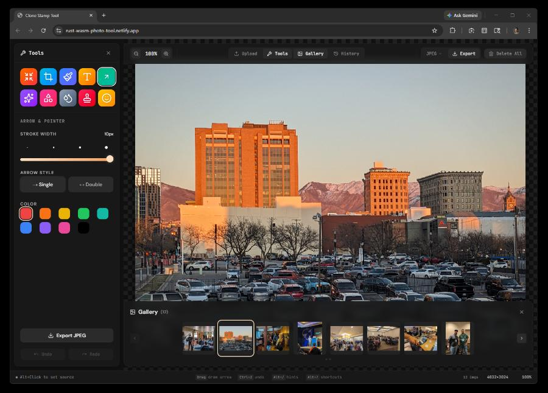

Rust WASM Photo Tool



**Live:** [rust-wasm-photo-tool.netlify.app](https://rust-wasm-photo-tool.netlify.app/) &nbsp;·&nbsp; [Architecture](Architecture.md)

A browser-based image annotation and editing tool powered by **Rust/WASM** for pixel-level operations, **React + TypeScript** for the UI, and **Convex** for persistent storage.

## Architecture

```
┌─────────────────────────────────────────────────────────────────┐
│  Browser                                                        │
│                                                                 │
│  ┌──────────────────────────────────────────────────────────┐   │
│  │  React UI Shell (Framer Motion, Tailwind CSS)            │   │
│  │                                                          │   │
│  │  TopBar · ToolsSidebar · GalleryBar · HistoryPanel        │   │
│  │  UploadDialog · StatusBar · ShortcutModal                │   │
│  └────────────────────┬─────────────────────────────────────┘   │
│                       │ useCloneStamp hook                      │
│                       ▼                                         │
│  ┌──────────────────────────────────────────────────────────┐   │
│  │  stamp_tool.wasm  (single binary, ~80KB gzipped)         │   │
│  │                                                          │   │
│  │  ┌──────────┐ ┌──────────┐ ┌───────────┐ ┌──────────┐   │   │
│  │  │  core    │ │  stamp   │ │ transform │ │ filters  │   │   │
│  │  │ ImageBuf │ │ Brush    │ │ Flip/Rot  │ │ Bright   │   │   │
│  │  │ Bilinear │ │ Dab/Strk │ │ Copy/Pste │ │ Contrast │   │   │
│  │  └──────────┘ └──────────┘ └───────────┘ └──────────┘   │   │
│  │  ┌──────────┐ ┌──────────┐ ┌───────────┐                │   │
│  │  │  codec   │ │ history  │ │ drawing   │ All share one  │   │
│  │  │ PNG enc  │ │ Undo/Redo│ │ Arrows    │ pixel buffer   │   │
│  │  │ Thumbnail│ │ Snapshot │ │ Shapes    │ in WASM linear │   │
│  │  └──────────┘ └──────────┘ └───────────┘ memory.        │   │
│  └──────────────────────────────────────────────────────────┘   │
│                       │                                         │
│                       ▼                                         │
│  ┌──────────────────────────────────────────────────────────┐   │
│  │  Convex (persistent layer)                               │   │
│  │                                                          │   │
│  │  userProfiles · projects · images · layers               │   │
│  │  annotations · history · ai_jobs · subscriptions         │   │
│  │                                                          │   │
│  │  Auth via @convex-dev/auth (Clerk)                       │   │
│  └──────────────────────────────────────────────────────────┘   │
│                                                                 │
│  JPEG/WebP/AVIF export → browser canvas.toBlob()                │
│  PNG export → Rust `png` crate (lossless, no canvas needed)     │
└─────────────────────────────────────────────────────────────────┘
```

### Why one WASM binary?

Separate `.wasm` modules (image-core.wasm, filters.wasm, etc.) would require copying the full pixel buffer across WASM memory boundaries on every operation — a 3.2MB copy for a 896×896 image, per handoff. A single binary with Rust modules shares one `Vec<u8>` in linear memory. Zero-copy, zero overhead.

### Why browser codecs for JPEG/WebP/AVIF?

The `image` crate with all codec features adds ~800KB to the WASM binary. The browser's `canvas.toBlob()` already has hardware-accelerated JPEG, WebP, and AVIF encoders built in. Rust handles PNG encoding (lossless, needed for pixel-perfect export), and JS delegates the rest to the browser. Best of both worlds.

### Rust ↔ Convex Bridge

**Principle**: WASM processes pixels locally (fast, zero-latency). Convex stores metadata, persistent history, and project state. React hooks bridge both.

- **Image Change History** — Every WASM operation that pushes an undo snapshot also records to Convex via `useConvexHistory.recordAction()`. Session-local undo/redo is instant (WASM memory); Convex gives a persistent, queryable audit trail.
- **Annotations** — On committing arrows/shapes/text, annotation metadata (geometry, color, timestamp) is saved to the Convex `annotations` table, enabling cross-session recovery and future collaboration.
- **AI Jobs Pipeline** — UI triggers → `api.ai_jobs.create(...)` → Convex action calls Replicate → webhook updates status → `useQuery` auto-updates UI → result loaded into WASM buffer.

## Rust Module Map

```
src/
├── lib.rs          #[wasm_bindgen] glue — CloneStampTool struct, delegates to modules
├── core.rs         ImageBuffer — width, height, data, load, bilinear sampling
├── history.rs      Snapshot (data + dimensions), undo/redo stacks, push, jump, delete, labels
├── stamp.rs        Clone stamp engine — source, offset, stroke lifecycle, dab kernel
├── transform.rs    Flip H/V, rotate 90° CW/CCW, resize (bilinear), copy_region, paste_region,
│                   crop overlay compositing, dashed border drawing
├── filters.rs      Brightness, contrast, blur (box-blur region, stroke-based)
├── drawing.rs      Arrow rendering (anti-aliased, arrowhead), geometric shapes (rect, circle, line,
│                   hand-drawn circle)
└── codec.rs        PNG encoding, thumbnail generation with bilinear scaling
```

## Frontend Structure

```
app/src/
├── main.tsx                          Entry point
├── styles.css                        Design tokens + component styles
├── app/
│   ├── App.tsx                       Root
│   ├── AppShell.tsx                  Master orchestrator — state, panels, WASM bridge
│   └── useKeyboardShortcuts.ts       Centralized keyboard handler
├── hooks/
│   ├── useCloneStamp.ts              React hook wrapping the WASM CloneStampTool
│   ├── useBrushPreview.ts            Cursor preview overlay
│   ├── useDrawingTools.ts            Arrow/shape drawing + crop selection (SVG overlay)
│   ├── useEmojiTool.ts               Emoji stamp — OffscreenCanvas → WASM stamp_pixels
│   ├── usePaintTool.ts               Freehand paint/brush — WASM paint_dab + paint_stroke_to
│   ├── useTextTool.ts                Text overlay — browser canvas renders font → WASM stamp_pixels;
│   │                                 tracks last position for recent-text re-edit
│   ├── useRedStampTool.ts            Red stamp presets — OffscreenCanvas renders label →
│   │                                 WASM stamp_red (scales to brush size, "Red Stamp" history)
│   ├── useConvexHistory.ts           Convex history bridge (stub, ready for connection)
│   ├── useAutoCompress.ts            Auto-compress hook for resize workflow
│   └── stamp_tool.d.ts               TypeScript declarations for WASM interface
├── components/
│   ├── TopBar/                       Zoom, panel toggles, export dropdown, delete all
│   ├── StatusBar/                    Source status, shortcuts, dimensions, zoom %
│   ├── TabGroup.tsx                  Reusable tab switcher (Stamp, Effects, future panels)
│   ├── UserMenu.tsx                  Convex/Clerk user menu
│   ├── ConvexClerkProvider.tsx       Auth provider wrapper
│   └── ShortcutModal.tsx             Alt+/ keyboard reference overlay
├── features/
│   ├── canvas/
│   │   ├── CanvasArea.tsx            WASM canvas + brush cursor + SVG crop overlay with
│   │   │                             rule-of-thirds guides and 8 draggable resize handles
│   │   ├── CompareSlider.tsx         Squoosh-style A/B before/after comparison slider
│   │   └── HistoryPanel.tsx          Animated right-side undo/redo timeline
│   ├── gallery/
│   │   ├── GalleryBar.tsx            Bottom photo strip with thumbnails
│   │   └── PhotoThumb.tsx            Individual thumbnail component
│   ├── tools/
│   │   ├── ToolsSidebar.tsx          Animated left sidebar with tool grid
│   │   ├── ToolGrid.tsx              Gradient icon buttons
│   │   ├── ToolButton.tsx            Individual tool button
│   │   ├── toolConfig.ts             Tool definitions (10 tools)
│   │   └── settings/
│   │       ├── StampSettings.tsx     Tab-switched: Clone Stamp (size/hardness/opacity) +
│   │       │                         Red Stamps (presets with brush-size scaling)
│   │       ├── TransformCropSettings.tsx  Flip, rotate; crop apply button
│   │       ├── ResizeSettings.tsx    Width/height, aspect lock, format, quality, A/B compare,
│   │       │                         auto-compress, lighthouse score
│   │       ├── EffectsSettings.tsx   Tab-switched: Effects (brightness/contrast) +
│   │       │                         Blur Brush (radius, intensity)
│   │       ├── ArrowSettings.tsx     Arrow color, stroke width, head style
│   │       ├── ShapeSettings.tsx     Shape type, fill/stroke color, line width
│   │       ├── EmojiSettings.tsx     Emoji picker (@emoji-mart), size presets
│   │       ├── PaintSettings.tsx     Brush size presets, color palette, opacity
│   │       └── TextSettings.tsx      Font size/weight/color; up to 8 recent texts
│   │                                 (click to re-open canvas box at last position)
│   └── upload/
│       └── UploadDialog.tsx          Drag-and-drop + paste-from-clipboard upload modal
└── lib/
    ├── types.ts                      Shared type definitions
    ├── animations.ts                 Framer Motion spring variants
    ├── defaultToolSettings.ts        Default tool settings
    └── utils.ts                      cn() utility
```

## Keyboard Shortcuts

| Shortcut           | Action                         |
| ------------------ | ------------------------------ |
| `Alt + U`          | Toggle Upload                  |
| `Alt + S`          | Toggle Tools                   |
| `Alt + G`          | Toggle Gallery                 |
| `Alt + H`          | Toggle History                 |
| `Alt + /`          | Show Shortcut Modal            |
| `Ctrl + Z`         | Undo                           |
| `Ctrl + Shift + Z` | Redo                           |
| `Alt + E`          | Export                         |
| `Alt + D`          | Delete All Images              |
| `Alt + [`          | Decrease Brush Size            |
| `Alt + ]`          | Increase Brush Size            |
| `Alt + Click`      | Set Clone Source               |
| `Alt + Scroll`     | Zoom In / Out                  |
| `Space` (hold)     | Pan mode (grab to drag canvas) |
| `PgUp / PgDn`      | Cycle gallery photos           |
| `Ctrl + Shift + C` | Copy canvas to clipboard       |

## Features

### Image Processing (Rust/WASM)

- **Clone Stamp** — Alt+Click source, paint to clone with adjustable size, hardness, opacity, spacing
- **Red Stamps** — REJECTED / APPROVED / DRAFT / CONFIDENTIAL / UNDER REVIEW presets; JS renders label to OffscreenCanvas, Rust scales to brush size via bilinear resize and composites with "Red Stamp" history entry
- **Transforms** — Flip horizontal/vertical, rotate 90° CW/CCW
- **Crop** — Interactive SVG overlay with rule-of-thirds guides and 8 draggable resize handles; crop committed through Rust
- **Resize** — Bilinear-scaled resize fully in WASM; no canvas round-trip
- **Effects** — Brightness (−100% to +100%), contrast (0% to 300%); each adjustment is a separate undo snapshot
- **Blur Brush** — Box-blur with stroke-based region masking; configurable radius and intensity
- **Arrows** — Anti-aliased arrows with arrowhead (single or double), drawn directly on the pixel buffer
- **Shapes** — Rectangles, circles, hand-drawn circles, and lines rendered in WASM
- **Paint / Brush** — Freehand painting via WASM `paint_dab` + `paint_stroke_to`; configurable brush size, color, and opacity
- **Text** — Click-to-place text with configurable font size, weight, and color; browser renders the font, pixels composited into the buffer via `stamp_pixels()`; up to 8 recent texts that re-open the canvas text box at the last used position
- **Emoji Stamp** — Browser renders emoji to `OffscreenCanvas`, pixels sent to WASM `stamp_pixels()` for alpha compositing
- **Export** — Lossless PNG via Rust encoder, JPEG/WebP/AVIF via browser
- **Thumbnails** — Bilinear-scaled thumbnails generated in WASM
- **Copy/Paste Regions** — Cross-photo pixel compositing with alpha blending; paste from clipboard supported
- **History** — 50-step undo/redo with labeled snapshots (including dimensions for crop/resize/rotate correctness), jump-to, delete entry

### UI (React)

- **Animated Panels** — Staggered entrance: TopBar → Sidebar → Gallery (Framer Motion springs)
- **Tool Grid** — 10 tools with gradient icons: Clone Stamp, Resize, Crop, Paint, Text, Arrows, Shapes, Effects, Emoji, AI
- **Tab Switchers** — Stamp (Clone / Red Stamps), Effects (Effects / Blur Brush) via shared `TabGroup` component
- **Spacebar Pan** — Hold Space for grab-to-pan; all tool handlers bypassed during pan
- **A/B Compare Slider** — Squoosh-style draggable divider to compare before/after edits
- **Multi-photo Gallery** — Bottom strip with thumbnails, add/remove/switch; PgUp/PgDn cycling
- **History Timeline** — Right-side panel with clickable undo/redo entries
- **Upload** — Drag-and-drop modal with file browser and paste-from-clipboard (Ctrl+V / paste button)
- **Export Dropdown** — PNG, JPEG, WebP, AVIF format selector in the top bar
- **Keyboard Hints** — Alt+/ shows badges on all buttons + shortcut reference modal
- **AI Panel** — Placeholder cards for: Remove Background (rembg), 4× Upscale (Real-ESRGAN), Object Removal (SD Inpaint), Auto Alt Text (BLIP), Smart Crop, Auto-Enhance — wired to Convex `ai_jobs` + Replicate when ready
- **Dark Theme** — JetBrains Mono + DM Sans, dark palette with accent highlights

## Tech Stack

- **Rust** — WASM processing layer (`wasm-bindgen`, `png` crate)
- **React 19** — UI framework
- **TypeScript** — Type safety
- **Vite** — Build tool with WASM support
- **Tailwind CSS** — Utility styling
- **Framer Motion** — Panel animations
- **Lucide React** — Icons
- **Convex** — Real-time database + auth + serverless functions
- **Clerk** — Authentication (via `@convex-dev/auth`)

## Getting Started

```bash
# Build the WASM module
wasm-pack build --target web

# Install frontend dependencies
cd app
pnpm install

# Start development server
pnpm dev
```

### With Convex

```bash
# In a separate terminal from the app/ directory
npx convex dev
```

Set up `app/.env.local` (never committed — see `.gitignore`):

```
VITE_CONVEX_URL=https://your-deployment.convex.cloud
VITE_CLERK_PUBLISHABLE_KEY=pk_...
```

## v2.1 Change Summary

| # | Feature | Status |
|---|---------|--------|
| 1 | Convex DB + auth schema | Schema defined, bridge stub ready |
| 2 | Spacebar pan | Complete |
| 3 | Alt+Scroll zoom with pan compose | Complete |
| 4 | PgUp/PgDn gallery cycling | Complete |
| 5 | AI panel cards | Placeholder (Replicate pipeline pending) |
| 6 | Arrow peg circles (draggable endpoints) | Design spec, future |
| 7 | Blur → Effects panel (brightness + contrast + blur brush) | Complete |
| 8 | Architecture diagram opens in new tab | Complete |
| 9 | Crop SVG overlay with rule-of-thirds + resize handles | Complete |

## License

MIT
