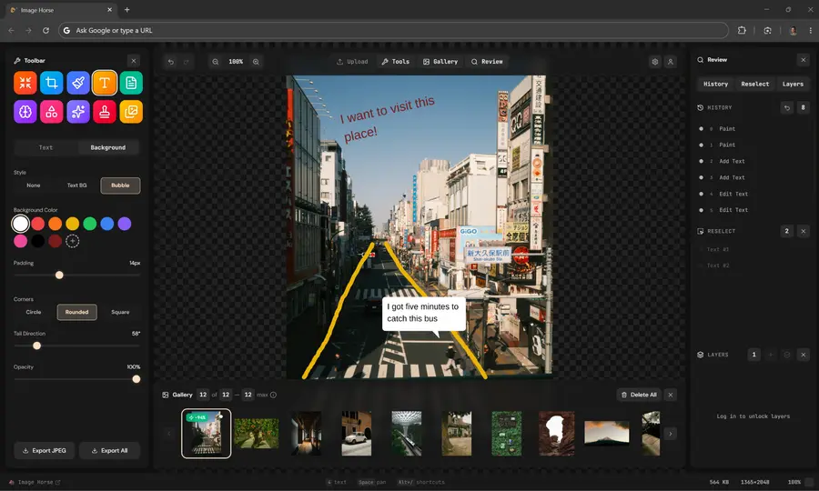

Image Horse



**Live:** [rust-wasm-photo-tool.netlify.app](https://rust-wasm-photo-tool.netlify.app/) &nbsp;·&nbsp; [](https://github.com/chrislanejones/rust-wasm-photo-tool/actions/workflows/ci.yml)

A browser-based image annotation and editing tool powered by **Rust/WASM** for pixel-level operations, **React + TypeScript** with **Zustand** state stores for the UI, and **Convex** for optional cloud persistence. Edits run locally in WebAssembly and your originals + edits live in the browser's **IndexedDB** — your pixels never leave the tab unless you sign in for persistence or AI features. Includes a **Batch Image Editor** for applying a logo to many photos in one pass, with a grid mosaic view of the gallery.

> Previously called **Clone Stamp App** — the app grew well beyond its origins as a single clone stamp tool.

## Documentation

- **[Architecture](docs/Architecture.md)** — system diagram, layers/compositing, the single-WASM-binary rationale, Rust ↔ Convex bridge.
- **[File Map](docs/File-Map.md)** — Rust module map (`src/`) and the React frontend structure (`app/src/`).
- **[Change Summary](docs/Change-summary.md)** — full dated release history (v2.1 → latest).
- **[Keyboard Shortcuts](docs/Keyboard-Shortcuts.md)** — every shortcut (tools, panels, transforms, zoom, gallery). The in-app modal (`Alt + /`) is the source of truth; this mirrors it.
- **[Getting Started](docs/Getting-Started.md)** — install, run the app + marketing site, Convex setup, deploy notes.
- **[Features](docs/Features.md)** — full feature list: Rust/WASM image processing + the React UI.
- **[GitHub Actions (CI)](docs/GitHub-Actions.md)** — the CI workflow jobs (build, security, audits) and Dependabot.
- **[CI Guardrails](docs/CI-Guardrails.md)** — the advisory `guardrails` job, flipping checks to blocking, and the local hook mirror.
- **[Refactor Playbook](docs/Refactor-Playbook.md)** — single-source-of-truth conventions (color / type / z-index tokens, React + Rust health, target folder structures) and the reusable guardrail bundle.
- **[State Management](docs/State-Management.md)** — the Zustand stores, the `SetArg` drop-in migration off AppShell's `useState`, and what stays local.
- **[IndexedDB Investigation](docs/IndexedDB-Investigation.md)** — why IndexedDB, the live content databases, the Zustand persist adapter, and the Dexie content layer.
- **[Service Workers & Caching](docs/Service-Workers-Caching.md)** — investigation: caching the WASM binary + app shell, the never-cache deny-list, and a phased PWA rollout.
- **[OpenRaster (.ora) Export/Import](docs/OpenRaster-Export-Import.md)** — layered `.ora` interchange: how export/import work and why the format was chosen. **Shipped.**
- **[Architecture Roadmap](docs/Architecture-Roadmap.md)** — the document-based-editor direction, prioritized and mapped onto the real repo (AppShell split, Zustand, workers, GPU).
- **[Entropy Report](docs/entropy-2026-07-30.md)** — dated structural-drift measurement: where AppShell actually is, whether the decompositions paid off, and what the hotspot list says.
- **[Content-Addressed GC Audit](docs/content-addressed-gc-audit.md)** — read-only reachability audit of everything in IndexedDB: what a collector would find, and the three orphan sources.
- **[Share-Links Auth Mismatch](docs/share-links-auth-mismatch.md)** — the two-Clerk-instance investigation, the prod auth verification, and the Stripe-linkage verdict.
- **[Security Hardening](docs/Security-Hardening.md)** — audit + roadmap: **the outstanding JWT key rotation**, share-token CSPRNG, the image-upload firewall, EXIF-by-default, and the supervised items (CSP, COEP, encryption).

## Tech Stack

- **Rust** — WASM processing layer (`wasm-bindgen`, `png` crate, `ab_glyph` fonts, SIMD128 kernels)
- **React 19** — UI framework
- **TypeScript** — Type safety
- **Zustand** — Client state management (UI / tool / gallery stores; IndexedDB-persisted prefs)
- **Vite** — Build tool with WASM support (`vite-plugin-wasm` + top-level await)
- **Tailwind CSS** — Utility styling (semantic design tokens)
- **Radix UI** — Accessible primitives (Dialog, Tooltip, Context Menu)
- **Framer Motion** — Panel animations
- **Lucide React** — Icons
- **Sonner** — Toast notifications
- **emoji-mart** — Emoji picker (stamp tool)
- **JSZip** — Client-side ZIP (batch export)
- **IndexedDB** — Local-first storage (originals, edits, gallery); **Dexie** content layer + Zustand persist adapter
- **Convex** — Real-time database + auth + serverless functions
- **Clerk** — Authentication (via `@convex-dev/auth`)
- **Stripe** — Payments / billing
- **Replicate** — AI image models (background removal, restore) via Convex

## The marketing site

`marketing/` — the five-page site at **[image-horse.vercel.app](https://image-horse.vercel.app/)**:
home, architecture, features, pricing, trail log. Vite + React 19 + react-router,
plain CSS off the tokens in `src/tokens.css` (no Tailwind, no UI library).
Vercel builds it via the root `vercel.json` — **don't delete that file**, it's what
points the deploy at `marketing/dist` instead of the app.

```bash
pnpm run dev:marketing      # local
pnpm run build:marketing    # production → marketing/dist
node marketing/scripts/gen-trail-data.mjs   # refresh the derived data (see below)
```

Its numbers are derived, never typed. `src/data/commits.ts` (the Trail Log's
commit squares) and `src/data/features.ts` come from `git log` and
`docs/Features.md` via `scripts/gen-trail-data.mjs` — **run it on every release**,
or the graph quietly keeps drawing last month. `src/data/releases.ts` is the
changelog itself, so that one is hand-written: add the new release at the top.

## Changelog

Latest release below. Full dated history → **[docs/Change-summary.md](docs/Change-summary.md)**.

### v7.64 — 2026-08-04

**You can change the colour of a shape you have already placed.** Click a square
or a circle you drew earlier, pick a colour, and it changes. Until this week it
did nothing at all: the shape kept whatever colour it was drawn with, and the
only way to change your mind was to delete it and draw it again. That bug was
seven weeks old. Stroke width, the arrow style and the fill controls were stuck
in the same way and are fixed with it.

The panel now also loads the shape's own settings when you click it, so it shows
you what the selected shape is rather than whatever you last used. (v7.63 shipped
the fix earlier the same day, but only handled the case where the colour you
clicked differed from the one the panel was already showing — so clicking the
colour you wanted could do nothing at all. This finishes it.)

Stroke width, the arrow style and the fill controls are fixed with it — they were
stuck for the same reason. Reselect a pin and recolour it and it stays a pin,
rather than turning into a plain circle.

Undo, saving and export were checked rather than assumed. Recolouring is one undo
step, so Ctrl+Z puts the old colour back — a whole run of changes to one shape is
a single step, not one per click. The new colour survives closing the picture and
opening it again. And it is the new colour that comes out in the file you export,
not just the one on screen.

**Dialogs keep the keyboard inside them.** With a dialog open, Tab used to walk
straight out of it and carry on through the page behind, and closing one left you
back at the top of the page instead of on the button you opened it from. Every
dialog now holds the keyboard while it is open and hands it back where you left
it — the delete confirmations, Settings, the shortcut list, the update prompt.
Screen readers are also told the rest of the app is inactive while a dialog is
up, which they were not before.

## License

MIT
