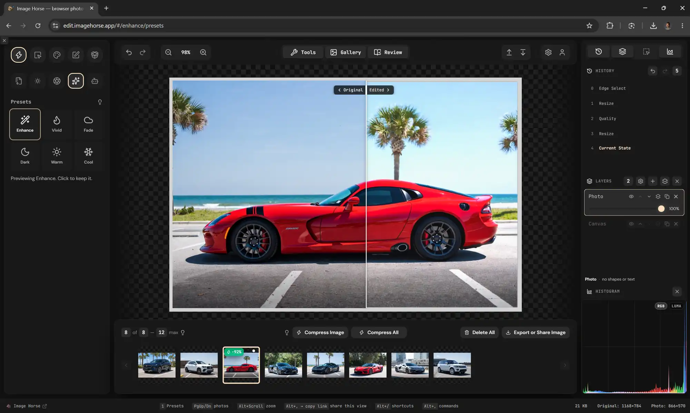

# Image Horse



**Live:** [imagehorse.app](https://imagehorse.app/) &nbsp;·&nbsp; **Editor:** [edit.imagehorse.app](https://edit.imagehorse.app/) &nbsp;·&nbsp; [](https://github.com/chrislanejones/rust-wasm-photo-tool/actions/workflows/ci.yml)

A browser-based image annotation and editing tool powered by **Rust/WASM** for pixel-level operations, **React + TypeScript** with **Zustand** state stores for the UI, and **Convex** for optional cloud persistence. Edits run locally in WebAssembly and your originals + edits live in the browser's **IndexedDB** — your pixels never leave the tab unless you sign in for persistence or AI features. Includes a **batch editor** that works across a whole gallery in one pass — stamp a logo, apply text, bulk-rename by pattern, or name every photo from what is actually in it with a local describer that needs no account and no per-image cost.

> Previously called **Clone Stamp App** — the app grew well beyond its origins as a single clone stamp tool.

## Quick start

Needs Node + [pnpm](https://pnpm.io/), and the Rust toolchain plus
[`wasm-pack`](https://rustwasm.github.io/wasm-pack/) to build the engine.

```bash
pnpm install
pnpm run build:wasm   # compile the Rust engine -> pkg/  (required before first run)
pnpm run dev          # editor at localhost:5173
```

`pnpm run build` bundles whatever is already in `pkg/` — it does **not** rebuild the
engine. After changing anything under `src/`, run `build:wasm` again, or use
`pnpm run build:all` to do both. A stale `pkg/` looks exactly like a broken feature.

Convex and Clerk are optional: with no keys set the app runs fully logged-out,
which is a supported path and not a degraded one. Full setup, deploy notes and
environment variables → **[Getting Started](docs/Getting-Started.md)**.

## Documentation

- **[Getting Started](docs/Getting-Started.md)** — install it, run the app and the marketing site, set up Convex, deploy.
- **[Architecture](docs/Architecture.md)** — how it fits together: layers and compositing, why one WASM binary, the Rust ↔ Convex bridge.
- **[File Map](docs/File-Map.md)** — where everything lives, in both the Rust crate (`src/`) and the React app (`app/src/`).
- **[Features](docs/Features.md)** — what it can actually do, end to end.
- **[Keyboard Shortcuts](docs/Keyboard-Shortcuts.md)** — every binding. The in-app modal (`Alt + /`) is authoritative for the tool digits; this mirrors it.
- **[OpenRaster (.ora)](docs/OpenRaster-Export-Import.md)** — layered interchange with Krita, GIMP and friends: how import/export work, and why this format.
- **[CI](docs/CI.md)** — the workflow jobs, the deploy sentinel, the static guardrails, and the local git hooks.
- **[Deploying](docs/Deploying.md)** — the two Vercel projects, the prerender step that makes the marketing site indexable, DNS, and the in-progress move of the editor off Netlify.
- **[Change Summary](docs/Change-summary.md)** — the full dated release history.

Design decisions live in **[docs/adr/](docs/adr/INDEX.md)**. Superseded investigations and planning notes are kept in **[docs/archive/](docs/archive/README.md)** rather than deleted — each one says what went stale about it.

## Tech Stack

- **Rust** — WASM processing layer (`wasm-bindgen`, `png` crate, `ab_glyph` fonts, SIMD128 kernels)
- **React 19** — UI framework (19.2.x, pinned through the pnpm catalog)
- **TypeScript** — Type safety
- **Zustand** — Client state management (UI / tool / gallery stores; IndexedDB-persisted prefs)
- **Vite** — Build tool with WASM support (`vite-plugin-wasm` + top-level await)
- **Tailwind CSS v4** — Utility styling via semantic design tokens; core utilities only, variants via cva
- **Radix UI** — Accessible primitives (Dialog, Tooltip, Context Menu)
- **Framer Motion** — Panel animations
- **Lucide React** — Icons
- **Sonner** — Toast notifications
- **emoji-mart** — Emoji picker (stamp tool)
- **JSZip** — Client-side ZIP (batch export)
- **IndexedDB** — Local-first storage (originals, edits, gallery); **Dexie** content layer + Zustand persist adapter
- **Convex** — Real-time database + auth + serverless functions
- **Clerk** — Authentication, wired to Convex through `ConvexProviderWithClerk` (`convex/react-clerk`)
- **Stripe** — Payments / billing, called over raw REST from Convex (no SDK dependency)
- **Replicate** — AI image models (background removal, restore) via Convex

## The marketing site

`marketing/` — the five-page site at **[imagehorse.app](https://imagehorse.app/)**:
home, architecture, features, pricing, trail log. Vite + React 19 + react-router,
plain CSS off the tokens in `src/tokens.css` (no Tailwind, no UI library).
Vercel builds it via the root `vercel.json` — **don't delete that file**, it's what
points the deploy at `marketing/dist` instead of the app.

```bash
pnpm run dev:marketing      # local
pnpm run build:marketing    # production → marketing/dist
node marketing/scripts/gen-trail-data.mjs   # refresh the derived data (see below)
```

Its numbers are derived, never typed. `src/data/commits.ts` (the Trail Log's
commit squares) and `src/data/features.ts` come from `git log` and
`docs/Features.md` via `scripts/gen-trail-data.mjs` — **run it on every release**,
or the graph quietly keeps drawing last month. `src/data/releases.ts` is the
changelog itself, so that one is hand-written: add the new release at the top.

## Changelog

Latest release below. Full dated history → **[docs/Change-summary.md](docs/Change-summary.md)**.

### v8.81 — 2026-09-21

**Twelve presets instead of six, H is the hand key, and the legal pages Google kept asking for are live.**

Enhance › Presets has twelve looks now. Mono and Noir are the two black-and-whites
— one that leaves the tones where they were, one with hard contrast and heavy
blacks. Airy opens a picture up bright and light, Moody closes the shadows down,
and Recover and Lift pull detail back out of a blown-out sky or a backlit
subject. Hover any of them to see it on your photo before you commit. Clicking
is still one undo step.

There is no hue or temperature knob in the engine, and that is why the twelve
look the way they do. Shadows and highlights add the same amount to red, green
and blue, so every preset moves brightness, contrast or how much color is there
— never the color itself. Warm and Cool have always been saturation, not
temperature. A sepia cannot be written as a row in that table at all.

A preset is five numbers, and two of them are absolute 8-bit values where a
tenth of a level does nothing. A new test hovers all twelve and compares pixels,
to the untouched photo and to every preset before it, so a preset that quietly
does less than it says — or one that duplicates another — fails instead of
shipping.

**H is the hand key.** Hold it to pan and it stops when you let go; tap it and
panning stays on until you tap again or press Esc. Space still pans. But Space
can never be the reliable pan key, because a focused button takes it — that is
how Tab-then-Space presses things. H is not an activation key, so nothing on the
page can steal it.

`/privacy-policy` and `/terms-of-service` exist. Google's consent screen will
not pass the sign-in client without both on an authorized domain, and both were
404. The privacy page names each thing that leaves the device one at a time, and
says what stays: the gallery in IndexedDB, with no backup and no copy anyone
here can read. The paragraph a template would have got wrong is analytics — GA4
runs on both sites, ungated, and sets cookies. Once there is a privacy policy,
saying so is the only honest option.

Create AI Image speaks the sidebar's language. The panel moved into its own
component and picked up the shared form controls on the way, so it looks like
the rest of the app instead of hand-rolled, and it scrolls on a short screen. It
picks its own model now — six of them, differing in speed, cost and whether they
can take a reference image at all. Your references are kept when you switch
models but only counted in the consent sentence when the model can use them.
Generate is still disabled: there is no text-to-image job on the server yet.

The engine did not change this release. It is the same 814,202 bytes v8.80
shipped.


## License

MIT
