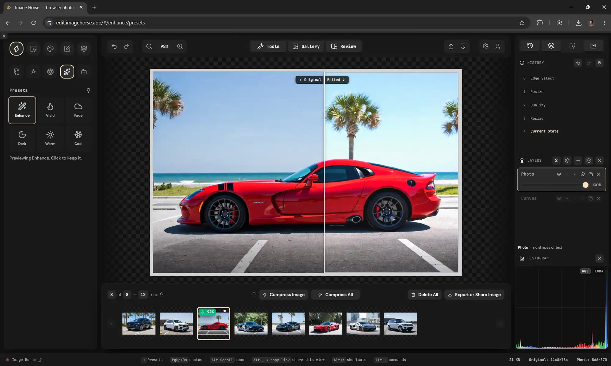

# Image Horse



**Live:** [imagehorse.app](https://imagehorse.app/) &nbsp;·&nbsp; **Editor:** [edit.imagehorse.app](https://edit.imagehorse.app/) &nbsp;·&nbsp; [](https://github.com/chrislanejones/rust-wasm-photo-tool/actions/workflows/ci.yml)

A browser-based image annotation and editing tool powered by **Rust/WASM** for pixel-level operations, **React + TypeScript** with **Zustand** state stores for the UI, and **Convex** for optional cloud persistence. Edits run locally in WebAssembly and your originals + edits live in the browser's **IndexedDB** — your pixels never leave the tab unless you sign in for persistence or AI features. Includes a **batch editor** that works across a whole gallery in one pass — stamp a logo, apply text, bulk-rename by pattern, or name every photo from what is actually in it with a local describer that needs no account and no per-image cost.

> Previously called **Clone Stamp App** — the app grew well beyond its origins as a single clone stamp tool.

## Quick start

Needs Node + [pnpm](https://pnpm.io/), and the Rust toolchain plus
[`wasm-pack`](https://rustwasm.github.io/wasm-pack/) to build the engine.

```bash
pnpm install
pnpm run build:wasm   # compile the Rust engine -> pkg/  (required before first run)
pnpm run dev          # editor at localhost:5173
```

`pnpm run build` bundles whatever is already in `pkg/` — it does **not** rebuild the
engine. After changing anything under `src/`, run `build:wasm` again, or use
`pnpm run build:all` to do both. A stale `pkg/` looks exactly like a broken feature.

Convex and Clerk are optional: with no keys set the app runs fully logged-out,
which is a supported path and not a degraded one. Full setup, deploy notes and
environment variables → **[Getting Started](docs/Getting-Started.md)**.

## Documentation

- **[Getting Started](docs/Getting-Started.md)** — install it, run the app and the marketing site, set up Convex, deploy.
- **[Architecture](docs/Architecture.md)** — how it fits together: layers and compositing, why one WASM binary, the Rust ↔ Convex bridge.
- **[File Map](docs/File-Map.md)** — where everything lives, in both the Rust crate (`src/`) and the React app (`app/src/`).
- **[Features](docs/Features.md)** — what it can actually do, end to end.
- **[Keyboard Shortcuts](docs/Keyboard-Shortcuts.md)** — every binding. The in-app modal (`Alt + /`) is authoritative for the tool digits; this mirrors it.
- **[OpenRaster (.ora)](docs/OpenRaster-Export-Import.md)** — layered interchange with Krita, GIMP and friends: how import/export work, and why this format.
- **[CI](docs/CI.md)** — the workflow jobs, the deploy sentinel, the static guardrails, and the local git hooks.
- **[Deploying](docs/Deploying.md)** — the two Vercel projects, the prerender step that makes the marketing site indexable, DNS, and how the editor came off Netlify.
- **[Change Summary](docs/Change-summary.md)** — the full dated release history.

Design decisions live in **[docs/adr/](docs/adr/INDEX.md)**. Superseded investigations and planning notes are kept in **[docs/archive/](docs/archive/README.md)** rather than deleted — each one says what went stale about it.

## Tech Stack

- **Rust** — WASM processing layer (`wasm-bindgen`, `png` crate, `ab_glyph` fonts, SIMD128 kernels)
- **React 19** — UI framework (19.2.x, pinned through the pnpm catalog)
- **TypeScript** — Type safety
- **Zustand** — Client state management (UI / tool / gallery stores; IndexedDB-persisted prefs)
- **Vite** — Build tool with WASM support (`vite-plugin-wasm` + top-level await)
- **Tailwind CSS v4** — Utility styling via semantic design tokens; core utilities only, variants via cva
- **Radix UI** — Accessible primitives (Dialog, Tooltip, Context Menu)
- **Framer Motion** — Panel animations
- **Lucide React** — Icons
- **Sonner** — Toast notifications
- **emoji-mart** — Emoji picker (stamp tool)
- **JSZip** — Client-side ZIP (batch export)
- **IndexedDB** — Local-first storage (originals, edits, gallery); **Dexie** content layer + Zustand persist adapter
- **Convex** — Real-time database + auth + serverless functions
- **Clerk** — Authentication, wired to Convex through `ConvexProviderWithClerk` (`convex/react-clerk`)
- **Stripe** — Payments / billing, called over raw REST from Convex (no SDK dependency)
- **Replicate** — AI image models (background removal, restore) via Convex

## The marketing site

`marketing/` — the five-page site at **[imagehorse.app](https://imagehorse.app/)**:
home, architecture, features, pricing, trail log. Vite + React 19 + react-router,
plain CSS off the tokens in `src/tokens.css` (no Tailwind, no UI library).
Vercel builds it via the root `vercel.json` — **don't delete that file**, it's what
points the deploy at `marketing/dist` instead of the app.

```bash
pnpm run dev:marketing      # local
pnpm run build:marketing    # production → marketing/dist
node marketing/scripts/gen-trail-data.mjs   # refresh the derived data (see below)
```

Its numbers are derived, never typed. `src/data/commits.ts` (the Trail Log's
commit squares) and `src/data/features.ts` come from `git log` and
`docs/Features.md` via `scripts/gen-trail-data.mjs` — **run it on every release**,
or the graph quietly keeps drawing last month. `src/data/releases.ts` is the
changelog itself, so that one is hand-written: add the new release at the top.

## Changelog

Latest release below. Full dated history → **[docs/Change-summary.md](docs/Change-summary.md)**.

### v9.5 — 2026-09-30

**Switching photos fast no longer loses or mixes up your edits, SVGs come back out as SVGs, and AVIF is a real AVIF.**

Edit a photo, then page through the gallery fast. Before, the gallery could light
one photo while the canvas showed another, and the saved copy of the first photo
could end up with the second one's pixels. An edit you let go of an instant before
a switch is kept now. A crop box or selection from the last photo no longer
follows you to the next one.

The panels that belong to one photo (Resize, Crop & Transform, Perspective,
Adjustments, Layers, Canvas Size) now say which photo they are for, like
"1 of 2 · checker". The line lights up on every switch. While the next photo
loads the controls lock, and on a slow switch they turn into skeletons.

Upload an SVG, crop it, and download it as an SVG, alone or zipped with the
others. Only the frame changes, so the drawing stays a vector. The SVG is kept
for the session; reload and the SVG tile turns off until you upload it again.

AVIF export writes a real AVIF. Asking for one used to hand you a PNG. The
encoder is about 3.5 MB and loads the first time you export an AVIF, not before.

Batch › Crop: let go of the frame and the other photos shade what they will lose.
Hold Shift while you drag to break the ratio. Enter crops all of them.

Combine (New, Add, Subtract, Intersect) moved from Select to Review. Click a text
box or a shape in the list and its outline becomes the selection.

Download, Copy or Share is called Export now. The formats sit under "Image
format", ORA and PSD under "Layered file", and Download, Share link and Clipboard
have icons. The PSD tile says "Activate with plugin".

Dropping several photos on the New dialog imported each one twice. Once now.

### v9.4 — 2026-09-29

**Batch › Crop: every photo the same shape for a carousel, and you pick what each one keeps.**

Batch › Crop cuts every loaded photo to one ratio at once, and to one width if
you want it. Pick 4:5 at 1080 and every slide comes out 1080×1350.

The preview shows the crop. Drag the frame to move it, drag a corner to make it
smaller, or use the arrow keys. Each photo keeps its own frame, so you can click
through the gallery and frame every slide before you crop. Photos you don't
touch use the nine-cell grid. Cropping again starts from the original photo, and
the open photo's crop is one undo.

Download, Copy or Share starts with a choice now: this image, or all of them.
Download All used to write an unedited photo in whatever format you uploaded
it in. Every photo comes out in the format you pick now.

The old Netlify address redirects to edit.imagehorse.app, and Netlify builds
nothing.

### v9.3 — 2026-09-28

**A resize no longer makes a photo heavier, and a “Photo only” ZIP has no white line.**

A “Photo only” ZIP came out with every photo framed in a thin white line.
Saving a photo after a resize or a compression was writing the Canvas border
into the stored file, and the ZIP copies that file as it is. The stored file is
just the photo now, and the border is added only when you ask for it.

Apply Resize made photos heavier. It re-encoded at full quality, so a 33 KB
JPEG cut to half its width came back at 154 KB and its PageSpeed score fell
from 99 to 88. It keeps the quality the file was last saved at now, and a resize
that removes pixels never hands back a bigger file — the same photo comes back
at 32 KB. The score and the gallery's size badges read the real file, too.

Everything that can reach a server is one list: Settings › Security, the
online switch, the home page's table and the privacy policy all read it. Sync
reports in the status line, failures included, with a Retry. On a phone, 27
invisible desktop controls are out of the tab order.

A third blog post, “We spent a month taking the file apart. It got 556 lines
longer.” The blog reads on a 320px phone now, and the menu bar's name no
longer gets cut to “Image Ho”.

Engine 819,031 → 820,591 bytes.

### v9.2 — 2026-09-28

**The Select panel's Refine section is readable, and Pro signups are closed.**

Refine was one button and five sliders stacked two across — ten rows of label,
number and track in a narrow column, all live at once, with nothing to say
which one to touch. It is six tiles now and a single slider that edits whichever
tile is open. Same five operations, same ranges. Remove Object moves into the
Selection grid as its sixth tile, filling a cell that had been empty since
September 11th and taking a whole section with it.

Pro signups are off. Nobody can start a subscription: the button is gone and
the server refuses the call behind it. Anyone who already has one can still
open the billing portal and cancel — that path is deliberately untouched.

Every push used to build both halves of the site, so a marketing typo ran the
editor's three-minute Rust build and an editor change rebuilt the marketing
site. Each now skips what it cannot affect: a third fewer builds, measured
across September.

Under that, AppShell lost another 152 lines to three extractions, and the
marketing site's tokens, class names and components are now a design system
Claude Design can build with.

Engine unchanged at 819,031 bytes.

### v9.1 — 2026-09-26

**The app tells you when a stroke will change a mask.**

Until now one tile label was the only thing that said a brush stroke would
change the mask instead of the pixels. Three things say it now, all reading the
same value: the tile, a line in the status bar, and the brush ring itself,
which turns the colour it is about to paint. Black hides, white reveals.

Every tool panel is laid out the same way — one header, one kind of row, and
the settings most strokes never need folded into an Advanced section at the
foot.

Under that, a large clean-up: eleven engine exports nothing called are gone,
and the drawing, cursor and preview code moved out of two very large files into
modules of their own. Nothing on screen changed.

Engine 819,031 bytes (was 824,286 — 5,255 smaller).

## License

MIT
